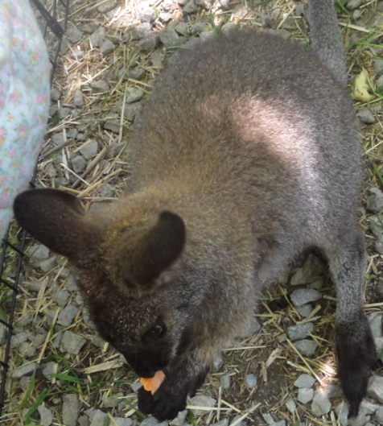

I'm currently on my summer holidays, and spending then at home in Nairobi. You'd think that means I have more time to work on my projects, relax, soak up some sun and blog more frequently. Nope. That's not happening. In fact the opposite had occurred, and I'm more busier than ever, and barely have any free time to watch TV!

I'm spending the majority of my time working at one of our family businesses, getting a chance to help setup and implement a new business software for the company as well as possibly start working on an app to showcase the companies products in a unique way to the companies clients. I'm also spending time in the different departments in our company, such as Marketing, Finance etc. so that I can better get to know how they work, and see if there's anything tech related I can create to make their work easier.

Before I left Toronto, I had a solid two weeks to experience a true "Torontonian Summer". I took part in a lot of different things such as the CUTC Hackathon that I blogged about before, as well as the Google I/O Extended Events at both the Google Kitchner Office, as well as in Downtown Toronto at UofT. The Waterloo/Kitchner I/O was a lot of fun. A friend and I went out there and spent the day together. We met people who attended the [Hack for Her Hackathon](http://aashni.me/blog/?p=39), as well as people who had attended the CUTC Hackathon. One guy recognized me from when my team stood up for our honourable mention. We spent our day gorging out on delicious food, watching interesting I/O videos, and talking to some truly interesting people - people who work at the Google, as well as visitors and students. And, as usual, we got swag. This time there was a shirt that said "Google I/O" on it, as well as keyrings, a water bottle and some glasses. We also got a really interesting google charger that's shaped as the android droid, and it's eyes light up when it's in use.

The I/O at Waterloo was only a day long, however it was a wonderful three day event at UofT, which meant I could join in with the fun on Thursday and Friday. This worked out perfectly, as it allowed me to take part in their hackathon. The hackathon was 24 hours long, and started at noon on Thursday, and carried on till noon the next day. My partner and I attempted to work on app called "So Fetch", which would allow you to pass on your contact and social media information easily to other people whilst in a busy area, such as a party or conference. It was both of our first times working on an app, and we didn't get as much working as we would have liked, however we had a great time and somehow managed to come 3rd overall! We hope to get a chance to keep on working on the app if possible.

After the hacking time ended, we got to present all our hacks to other people who took part. This was then followed by a really interested panel on "Careers in App Development", which I'd helped plan. We then had a few hours wait, in which I probably should have slept, but decided not to. Finally, around 9pm, there was an awesome party hosted for us at Spin Galactic, a pub in downtown Toronto that lets you play Ping Pong while you mingle. Let's just say, I had a blast!

I finally got home around 1:30 that night, and passed out like a baby. I'd been awake for 42 hours straight, and had no intention of doing that again. I spent my last few days in Toronto hanging out with my aunt and her kids, going to the park, seeing a Bison and Wallaby for the first time, and just enjoying the sun before returning back to Nairobi. Now the Nairobi stories are stories I can share another time...

