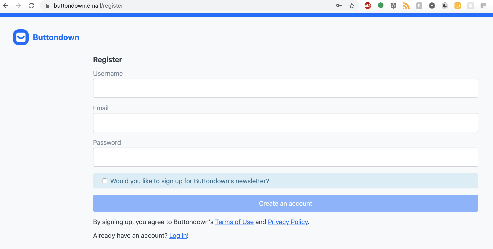
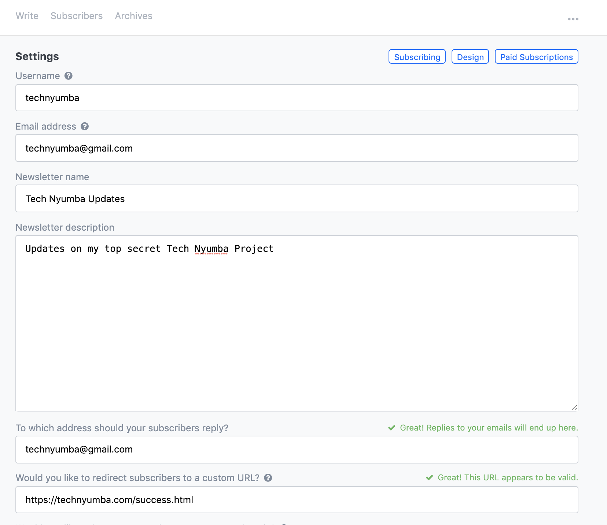
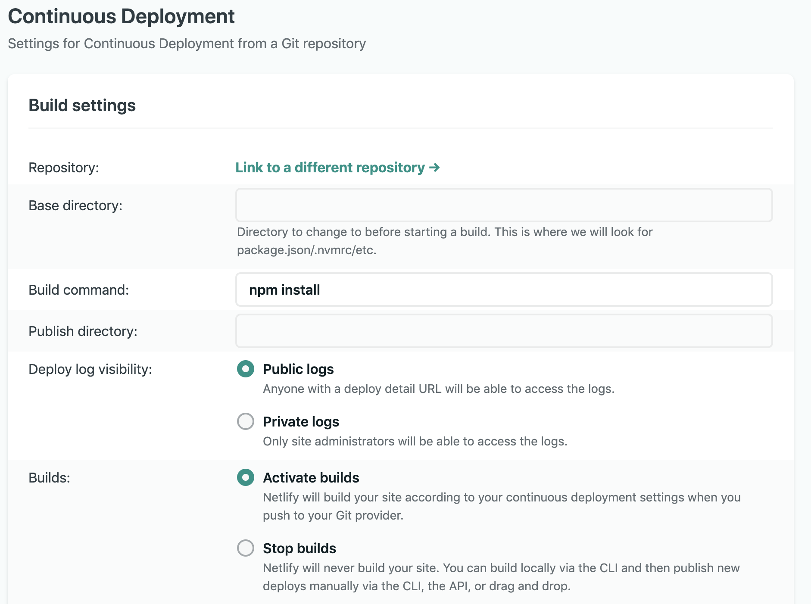
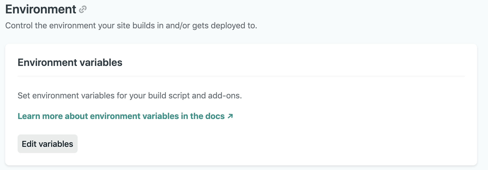
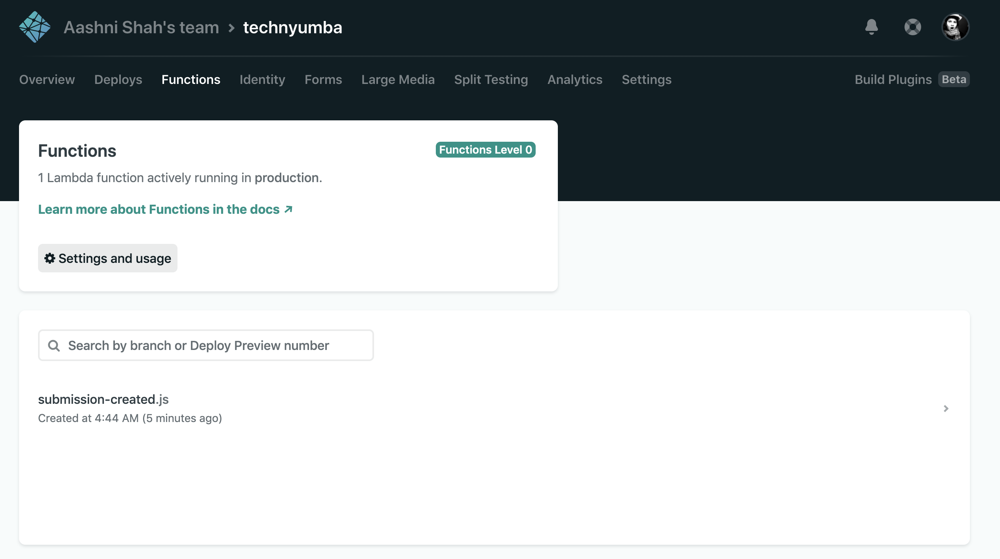
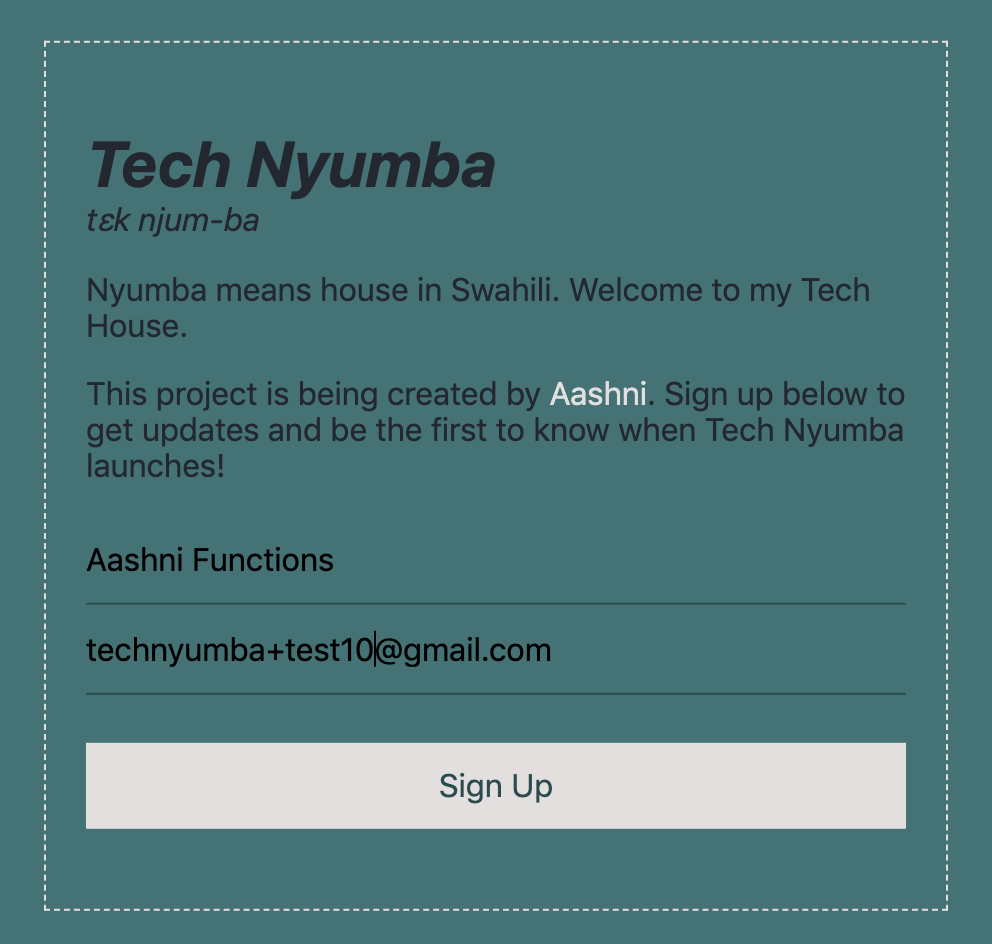
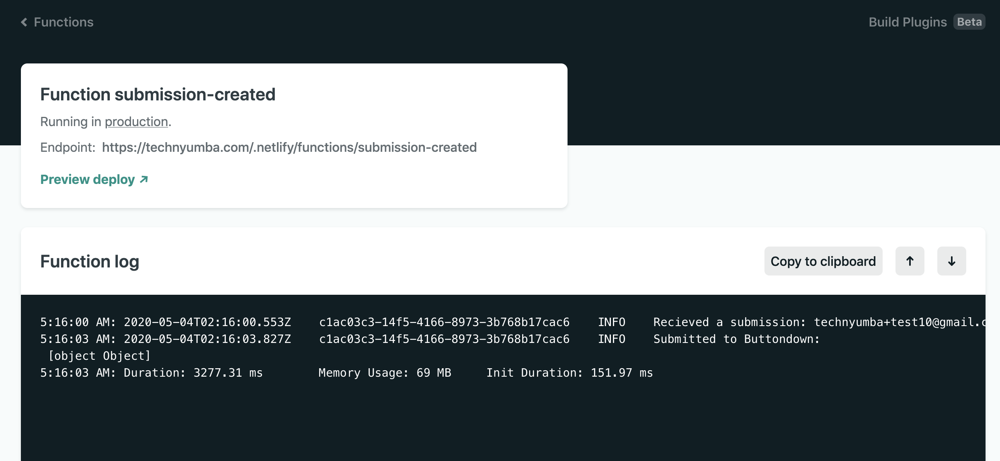
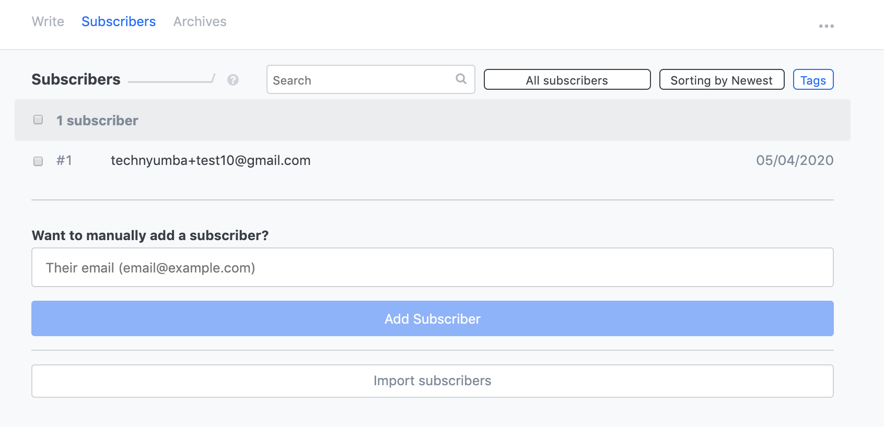
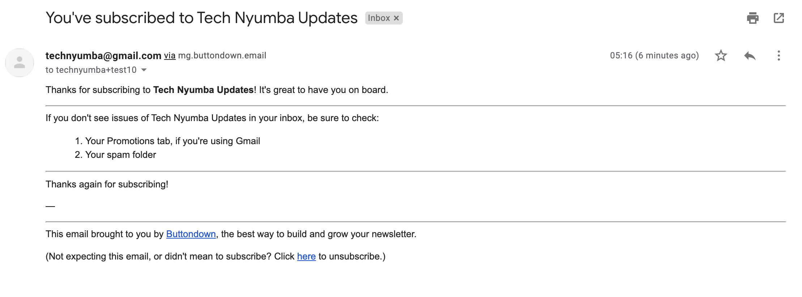

This is a follow up to my previous posts on [how to setup and host a website for free](../how-to-setup-and-host-a-website-for-free) and [how to add a contact form to your website for free](../how-to-add-a-contact-form-to-your-website-for-free). If you haven't already gotten your site setup with a contact form and hosted on Netlify, I recommend following those posts first. All code samples below will build on top of the previous codebase.

In this post, I'll walk you through how to create a contact form using [Netlify Forms](https://docs.netlify.com/forms/setup/). In my next post I'll talk about how you can convert the contact form into a subscription form that powers your own newsletter with [Netlify Functions](https://docs.netlify.com/functions/overview/) and [buttondown.email](http://buttondown.email/?utm_campaign=aashnisshah&utm_affiliate=affiliate).

_Note - as of writing this post, Netlify Forms allows 100 free emails a month, and ButtonDown.Email allows upto 1000 subscribers on their free plan_

## Creating your Buttondown.Email Account

If you haven't already, register for a [buttondown.email](http://buttondown.email/?utm_campaign=aashnisshah&utm_affiliate=affiliate) account.



Fill out the basic settings form. Below you'll see what I filled out for my settings. Note the `Would you like to redirect subscribers to a custom URL?` question. I set this to [technyumba.com/success.html](https://technyumba.com/success.html) which is the same success page we setup earlier, while creating the contact form. I left the rest of the settings as default settings. Make sure you keep the last option with the `Developers API Key` a secret.



## Configure dotEnv for Environment Variables

We need to configure our codebase to work with environment variables. I hope to write a more indepth version of what these variables are and why we use them in a future post. Essentially environmental variables allow you to safely and securely pass and store passwords or API keys for your app to use, without having to store them in your codebase. The easiest way to set this up is to initialize our project as an [npm](https://www.npmjs.com/) project, then make use of the [dotenv](https://www.npmjs.com/package/dotenv) module locally.

Install npm if you don't already have it. You can [read instructions on their site](https://www.npmjs.com/get-npm).

```bash
# Check if you have node. If it's installed you'll get a version back
node --version
# If you don't have node installed, install it from https://nodejs.org/en/download/

# Check if you have npm. If it's installed you'll get a version back
npm --version

# If you don't have npm installed, then install with the following command:
npm install npm@latest -g
```

Now we need to initialize npm in this project. Type the following command, then hit enter to select default options.

```bash
npm init
```

Next install `dotenv` and `node-fetch` - we'll use these later.

```bash
npm install --save dotenv
npm install --save node-fetch
```

Next create a file called `.env` - that's not a typo. We want the file name to be `.env` so we know it's an environment file. We'll add content to this file in a minute. In order for this to be effective, we need to make sure that the environment file doesn't accidentally get saved or stored on github. In order to avoid this, we'll need to add `.env` to the `.gitignore` file, which tells your git commands which files to ignore. Since we're here, we may as well also ignore the `node_modules/` folder created from npm above. This is what the `.gitignore` file will look like:

```javascript
.env*
node_modules/*
```

Let's commit the .gitignore file on github. If you run `git status`, you'll notice the `.env` file and `node_modules` folders doesn't show up if you configured the `.gitignore` properly. You should also notice the `package.json` and `package-lock.json` files appear. We'll commit and push all of these files.

```bash
git add .gitignore package.json package-lock.json
git commit -m "creating gitignore to ignore .env files"
git push
```

Now that we're using npm, we need to include this as part of our build process. Hop over to the Deploy settings for your project in Netlify, and update your `build step`. We'll want to set it to `npm install`, that way at build time Netlify will run `npm install` and install the two dependencies we're using, namely `dotenv` and `node-fetch`.



## Configuring Netlify Functions

Before we dive into using [Netlify Functions](https://docs.netlify.com/functions/overview/), it's worth spending time understanding what they are and how they can be used. Netlify Functions allow you to deploy serverless Lambda functions with function management handled directly within Netlify without having to configure or manage an entire server. What all this means is you can run code you'd normally need a server for simply by creating a javascript file in your project.

We'll start by configuring your Netlify account to know where to look for the functions file. Log on to your Netlify account, and head to the Functions settings for your domain. Press `Edit`, and then enter `functions` into the **Functions Directory** field. Save your settings.


Next create a folder called `functions` in your root directy. You can use this to store all your Netlify Functions moving forward.

```bash
# in root directory
mkdir functions
```

## Creating the Netlify Function

It's time to create our first netlify function. Netlify allows you to trigger certain serverless functions based on key Netlify events. A full list of these can be found [in their documentation](https://docs.netlify.com/functions/trigger-on-events/#available-triggers), but the one we're most interested in is `submission-created`, which is triggered anytime a new form submission is verified and submitted. Create a file called `submission-created.js` within the `functions` folder - this is where we'll code up the serverless function code.

```javascript
require("dotenv").config()

const fetch = require("node-fetch")
const { BUTTONDOWN_API_KEY } = process.env

exports.handler = async event => {
  const payload = JSON.parse(event.body).payload
  console.log(`Recieved a submission: ${payload.email}`)

  return fetch("https://api.buttondown.email/v1/subscribers", {
    method: "POST",
    headers: {
      Authorization: `Token ${BUTTONDOWN_API_KEY}`,
      "Content-Type": "application/json",
    },
    body: JSON.stringify({ email: payload.email, notes: payload.name }),
  })
    .then(response => response.json())
    .then(data => {
      console.log(`Submitted to Buttondown:\n ${data}`)
    })
    .catch(error => ({ statusCode: 422, body: String(error) }))
}
```

Let's explain what this code is doing.

The `require("dotenv").config()` let's the code know we're expecting config details from the environment. The next line set the `fetch` command which we'll use to perform the post request. After that, we're grabbing the API key from the environment file.

Now we enter the handler. Here we parse the event payload to extract out the email and name from our form. We make use of `console.log()` statements to help debug issues in the Netlify Functions output. The bulk of the code here creates a POST request to buttondown's `subscribers` API. On success, we output a success message, else we return an error. These can both be read on the Netlify Dashboard.

To conduct local testing, we'll add `BUTTONDOWN_API_KEY` to our `.env` file. Note that in this case, it won't do anything since we aren't running this file locally. This is what the `.env` file will look like, remember to swap `API_KEY_HERE` with your own API key, which you get at the bottom of your Buttondown API settings page.

```javascript
BUTTONDOWN_API_KEY = API_KEY_HERE
```

Let's get back to the terminal so we can push these changes to github. Note the changes we made to `.env` won't show up as the file is ignored.

```bash
git add functions/
git commit -m "Adding submission-created netlify function for form submissions"
git push
```

While we wait for the changes to hit the server, let's update a few more settings in Netlify. The first is adding the `BUTTONDOWN_API_KEY` to Netlify's environment. Head to your domains settings in Netlify, then select `Environment`.



Choose `Edit Variables`, then add `BUTTONDOWN_API_KEY` in the key option, and paste the api key into the value option. For a quick reminder, you can find your buttondown API key on your buttondown.email account settings page.


Next go to the `Functions` section of your proejct on Netlify. If we configured and pushed everything properly, we should see `submission-created.js`.



## Test It Out!

If you've reached this point, it looks like we have everything properly set up! Let's test out our form. Go back to your site, input a name and email into your contact form and hit submit.



Let's verify that everything works. First check your email to make sure you still got an email submission.


Next, go to your Netlify Function and click on `submission-created.js`. This brings up the logs from your Lambda function. Make sure no error messages show up there.



Finally, head to your buttondown account, and verify that your test user/email showed up on the subscribers list.



You'll also get an email from Buttondown letting you know you have a new subscriber!



Voila! It's alive and working! All you need to do is style your newsletters, then start sending them out. I send [my newsletters](https://aashni.me/newsletter) out once a week and would love if you subscribed!
