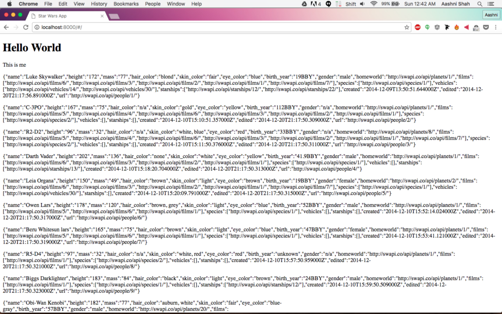

This is part 2 of a multi-part [Intro to AngularJS]../angularjs-an-introduction/) tutorial series. Part 1 can be found [here]../angularjs-tutorial-part-1-hello-world), and Part 3 can be found [here]../angularjs-tutorial-part-3-using-star-wars-api-data-through-angular-controllers-and-views).

Now that we have a Hello World version of our website working, we'll create a Service in order to connect to the Star Wars API.

First go back to the `index.html` file, and add the following line to the file. This will include the star wars service to the app.

    
    
    <!-- Services -->
    
    

Next we'll create a new folder called `services`, and inside this folder we'll create a file called `swapi.js`. In this file, we'll create an Angular service called `Swapi` that makes a call to the swapi API and calls for any information we can grab on the different characters from the Star Wars movie.

    
    
    var services = angular.module('swapi', []);
    
    services.factory('SwapiService', ['$http', 
      function($http){
        function Swapi(){};
    
        Swapi.domain = 'http://swapi.co/api';
    
        Swapi.people = function(){
          var path = '/people';
          var url = Swapi.domain + path;
    
          return $http.get(url)
            .then(function(response){
              return response;
            });
        };
            
        return Swapi;
      }
    ]);
    

Next you'll need to update the `SwapiApp` in `app.js` so that the angular module knows to include the swapi service. To do this, change the first line in the file to inject the Swapi service.

    
    
    var angularApp = angular.module('AngularApp', ['ngRoute', 'swapi']);
    

After this, we'll hook the swapi service to our controller. Going back to the `main.js`, we'll first inject our `swapi` service into the array and function call. We'll then create a call to the `SwapiService.people()` function we created in our service, and return all the collected data. Your updated code should look like below:

    
    
    angularApp.controller('MainCtrl', [ 
      '$scope',
      'SwapiService',
      function($scope, SwapiService){
        $scope.heading = "Hello World";
        $scope.message = "This is me";
    
        SwapiService.people()
          .then(function(data) {
            $scope.data = data.data.results;
        }); 
    
      }
    ]);
    

Lastly, we need to update our main view so that we can display the data onto our page. For now we'll just do a data dump and display everything that our API call returns. Once we have this working, we'll start doing some more interesting stuff with the data. So, open up the `main.html` page, and add the following lines of code to the end of the file.

    
    
    

      

        
{{person}}

      

    

    

One of my favorite features about AngularJS is that you can write for-loops in HTML! That's what the `ng-repeat` essentially lets you do. This goes through the `$scope.data` variable, and for each item in the data block, angular creates a `local` reference known as `person`. The `<h2>{{person}}</h2>` then outputs each persons information as a heading 2.

Let's go back to our browser and take a look at what's happened! If everything went as planned, then this is what you should see when you load up `http://localhost:8000`.

If you think you've made a mistake somewhere, you can access a copy of the above code from the accompanying github repository. [Click here](https://github.com/aashnisshah/lsh_angularjs_tutorial/commit/9fd51638c5861b6c928555b2a6cd36c2415715f5) to see all the code upto the end of this section.
