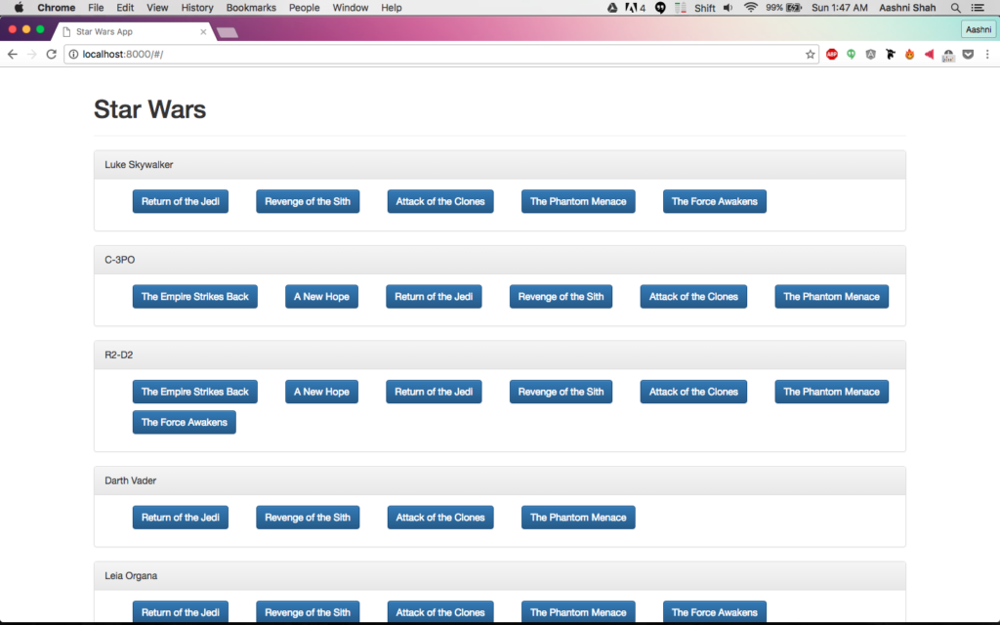

This is part 4 of a multi-part [Intro to AngularJS](../blog/angularjs-an-introduction/) tutorial series. Part 3 can be found [here](../blog/angularjs-tutorial-part-3-using-star-wars-api-data-through-angular-controllers-and-views), and Part 5 can be found [here](../blog/angularjs-tutorial-part-5-creating-individual-pages-for-characters-and-movies).

Since AngularJS uses HTML based views, it's extremely easy to add styling to your pages. I'll use Bootstrap to turn what we've made so far look a little nicer. Bootstrap is pretty easy to setup, however there are many other options when it comes to styling pages, for example using Material Design.

The first step is to include all the necessary Bootstrap files. I'll be using the hosted CDN files, and include those into the 'index.html' file, however you can also use other techniques like Bootstrap as a directive or BootstrapJS.

    <!-- Bootstrap -->
    <link rel="stylesheet" href="https://maxcdn.bootstrapcdn.com/bootstrap/3.3.7/css/bootstrap.min.css" integrity="sha384-BVYiiSIFeK1dGmJRAkycuHAHRg32OmUcww7on3RYdg4Va+PmSTsz/K68vbdEjh4u" crossorigin="anonymous">
    <link rel="stylesheet" href="https://maxcdn.bootstrapcdn.com/bootstrap/3.3.7/css/bootstrap-theme.min.css" integrity="sha384-rHyoN1iRsVXV4nD0JutlnGaslCJuC7uwjduW9SVrLvRYooPp2bWYgmgJQIXwl/Sp" crossorigin="anonymous">
    
    

Now for some Bootstrapping fun! We'll change the header, then make each character into their own div, and turn the movie names into buttons (we'll make these clickable buttons in the next section).

    

      

        <h1>Star Wars</h1>
      

      

        
{{ person.name }}

        

          <ul class="btn-group" ng-repeat="film in person.films">
            <button class="btn btn-primary">
              {{ films[film] }}
            </button>
          </ul>
        

      

    

Doesn't that look a lot better?

If you think you've made a mistake somewhere, you can access a copy of the above code from the accompanying github repository. [Click here](https://github.com/aashnisshah/lsh_angularjs_tutorial/commit/0c50a4c4ace82d711a56bd15620776c93e7e28b6) to see all the code upto the end of this section.
