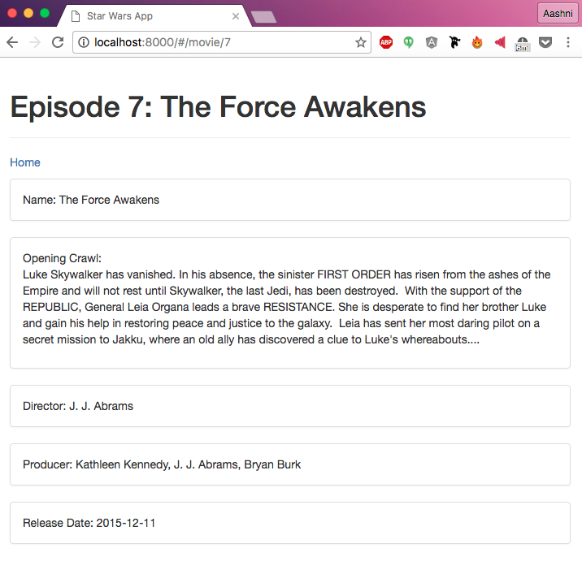
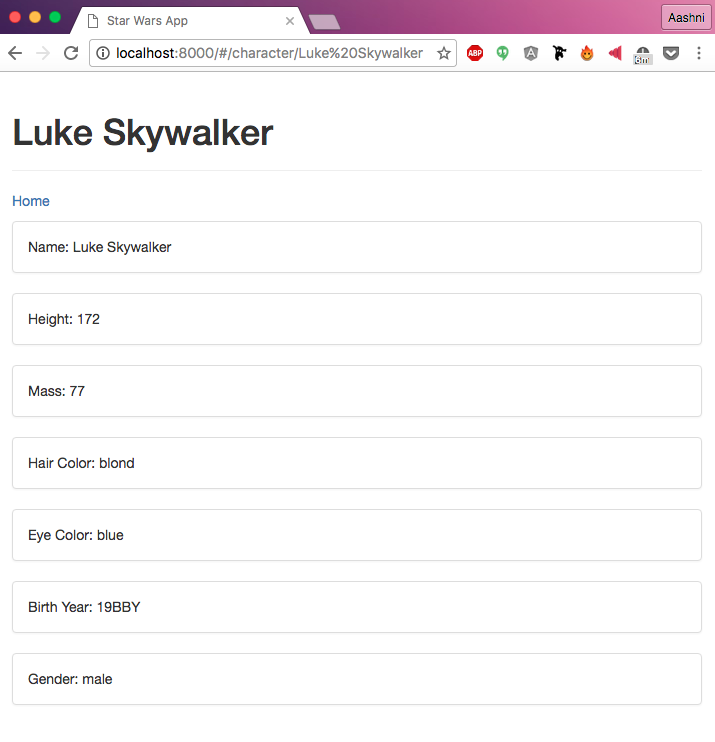
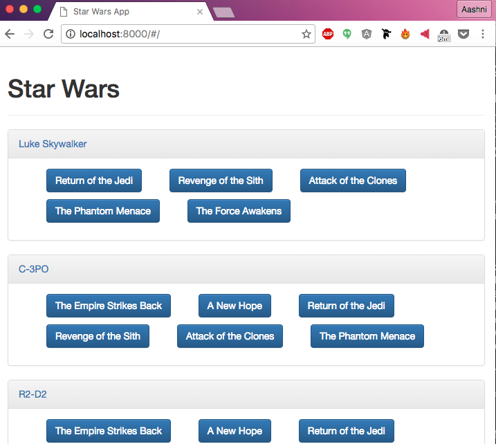

This is part 5 of a multi-part [Intro to AngularJS](../blog/angularjs-an-introduction/) tutorial series. Part 4 can be found [here](../blog/angularjs-tutorial-part-4-introducing-bootstrap).

Now we'll work on making individual pages for each Character and Movie. We'll begin by creating new routes in the `app.js` file.

    .when('/character/:id', {
      templateUrl: 'views/character.html',
      controller: 'CharacterCtrl',
      controllerAs: 'character'
    })
    .when('/movie/:id', {
      templateUrl: 'views/movie.html',
      controller: 'MovieCtrl',
      controllerAs: 'movie'
    })

Next we'll create new controllers and views for each file, as well as add references to these files into the `index.html` file.

    
    

In the character and movie controllers, we include `$routeParams` in the header. We will use this to access the `id` variable to figure out which character or movie is being accessed. We're also making use of a `loading` variable. This helps hide the `no character exists` message that would show up while the API call was being made. In both the character and movie views, we're making use of `ng-if`, which is essentially using an `if` statement in HTML! ISN'T THIS AMAZING?

First up, create a new file in your controllers folder called `character.js` with the following code. This code is somewhat similar to the code we have in our `main.js` controller.

    angularApp.controller('CharacterCtrl', [
      '$routeParams',
      '$scope',
      'SwapiService',
      function($routeParams, $scope, SwapiService){

        $scope.character = {};
        $scope.loading = true;
        $scope.id = $routeParams.id;

        SwapiService.people()
          .then(function(data) {
            angular.forEach(data.data.results, function(person) {
              if (person.name.toLowerCase() === $routeParams.id.toLowerCase()) {
                angular.copy(person, $scope.character);
                console.log(person);
              }
            });
            $scope.loading = false;
        });
      }
    ]);

Next, we'll create a new file in the views folder called `character.html` and add the following code. Similar to referencing `person.name` in the last section, we're referencing other data stored about the character such as their height.

    

      

        <h1>Loading...</h1>
      

    

    

      

        

          <h1>{{ character.name }}</h1>
        

        
<a href="#/">Home</a>

        

          

            Name: {{ character.name }}
          

        

        

          

            Height: {{ character.height }}
          

        

        

          

            Mass: {{ character.mass }}
          

        

        

          

            Hair Color: {{ character.hair_color }}
          

        

        

          

            Eye Color: {{ character.eye_color }}
          

        

        

          

            Birth Year: {{ character.birth_year }}
          

        

        

          

            Gender: {{ character.gender }}
          

        

      

      

        

          <h1>No one by the name {{ id }} exists :(</h1>
        

        <a href="#/">Return Home?</a>

      

    

Now we'll repeat what we did above to create a `movie.js` file in the `controllers` folder with the following `MovieCtrl` code.

    angularApp.controller('MovieCtrl', [
      '$routeParams',
      '$scope',
      'SwapiService',
      function($routeParams, $scope, SwapiService){

        $scope.movie = {};
        $scope.loading = true;
        $scope.id = $routeParams.id;

        SwapiService.films()
          .then(function(data) {
            angular.forEach(data.data.results, function(film) {
              if (film.episode_id == $routeParams.id) {
                angular.copy(film, $scope.movie);
              }
            });
            $scope.loading = false;
        });
      }
    ]);

And finally, we'll create a new file in `views` called `movie.html` to display the movie related information.

    

      

        <h1>Loading...</h1>
      

    

    

      

        

          <h1>Episode {{ id }}: {{ movie.title }}</h1>
        

        
<a href="#/">Home</a>

        

          

            Name: {{ movie.title }}
          

        

        

          

            Opening Crawl:
            

              {{ movie.opening_crawl }}
            

          

        

        

          

            Director: {{ movie.director }}
          

        

        

          

            Producer: {{ movie.producer }}
          

        

        

          

            Release Date: {{ movie.release_date }}
          

        

      

      

        

          <h1>There is no Episode {{ id }} yet :(</h1>
        

        <a href="#/">Return Home?</a>

      

    

The last thing we'll do is turn the names and buttons on the main page into links for each character or movie.

Before we update the `main.html` file, we'll first need to make a change to the `main.js` controller - right now we're only storing the Movie name. Instead of setting the `$scope.films[film]` to the film name, we'll point it to an object that contains both the title and episode id.

    $scope.films[api_call] = {
      'title': film.title,
      'episode_id': film.episode_id
    };

Head back to the `main.html` view and update the reference to the film name from `films[film]` to `films[film].title` HTML tag, with a few angular additions. First, each link will start with `#/`, this is because angular's default routing adds `#/` to the URL. You can change this later if you'd like. Next, we'll be creating the relative URL by using `#/movie/{{ movie.episode_id }}` for example, where Angular will replace `{{ movie.episode_id }}` with the `episode id`.

    <a href="#/character/{{ person.name }}">{{ person.name }}</a>

    <a href="#/movie/{{ films[film].episode_id }}">
      <button class="btn btn-primary">
      {{ films[film].title }}
      </button>
    </a>

And with that, we're done! Load `http://localhost:8000` in your browser and see the magic. You'll first be greeted by the original page we created, with the characters names and movies that each character has been in. Next if you click on a character name or movie title, you'll be taken to an information page about that character or movie.

If you think you've made a mistake somewhere, you can access a copy of the above code from the accompanying github repository. [Click here](https://github.com/aashnisshah/lsh_angularjs_tutorial/commit/1b04e6dfbcd201eabad133ee9534068aa5af90db) to see all the code upto the end of this section.
