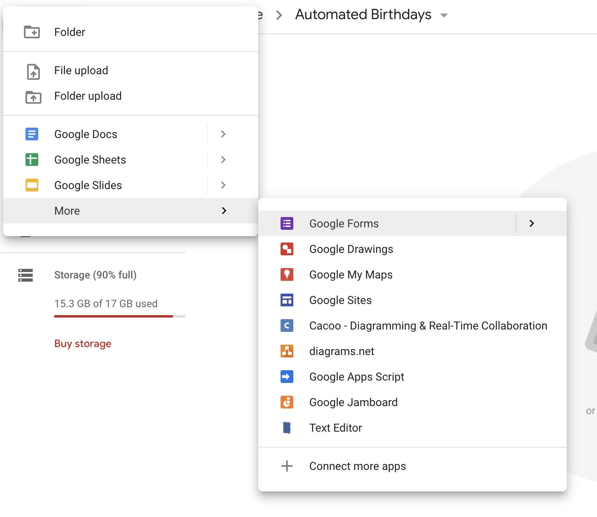
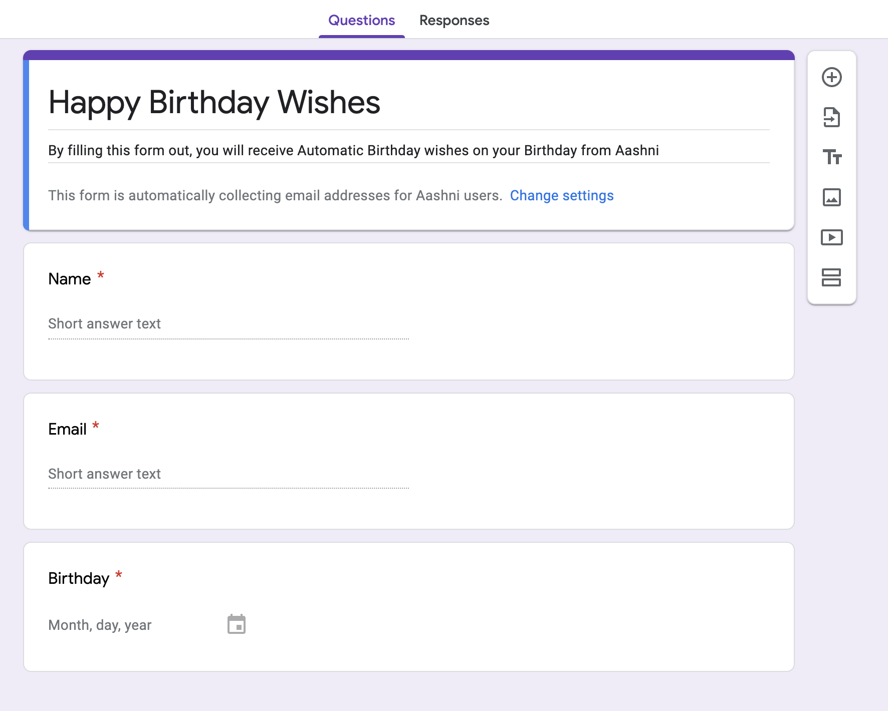
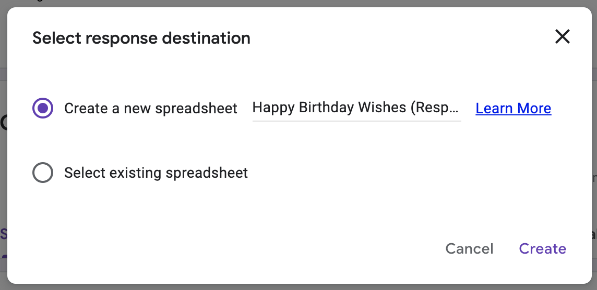
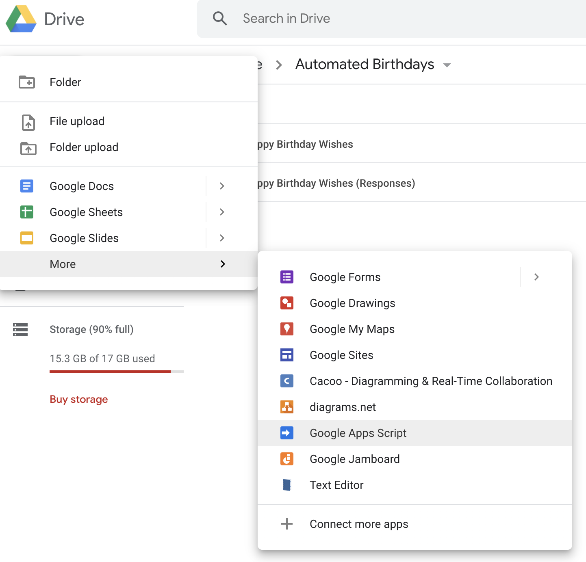
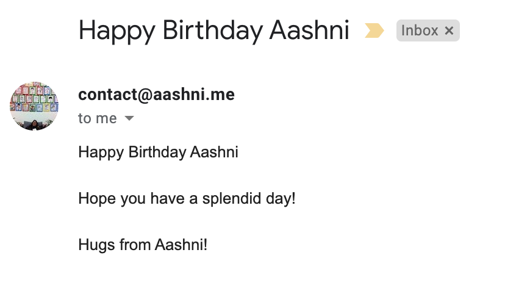
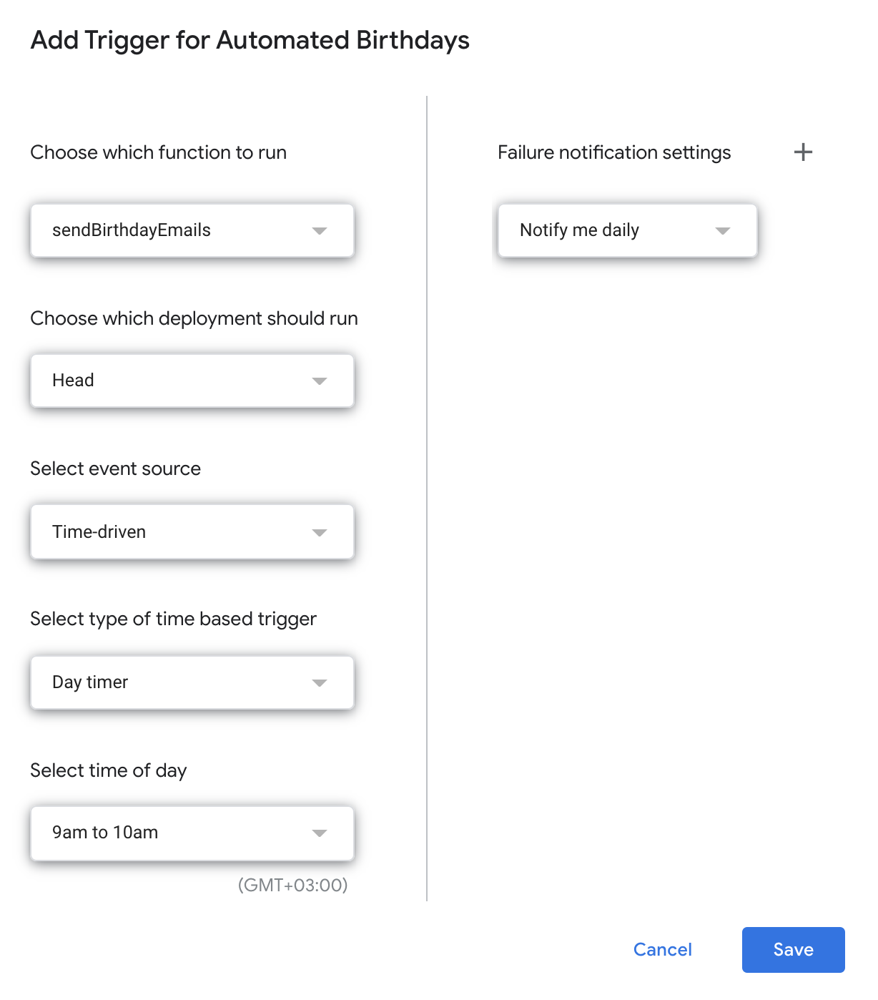

Last weekend my family hosted a virtual renunion call with our extended family. For context, we're 140+ people who live across 4 continents. One of our takeaways from that call is we'd like to stay better connected and I've been _**voluntold**_ to use technical products (google group style mailing list, whatsapp group) to help with this. One of the tasks I've been assigned was automating sending out emails to celebrate birthdays.

I know the popular option out there today is to use a combination of Airtable and Zapier, however since all the data lived in a Google Sheet document, I decided to challenge myself and stay within the Google eco-system. So I built an automated email system using Google Sheets and Google App Scripts, and now you can too!

# Setup
Really basic pre-requisite: you will need a google account. If you don't already have one, they're free to create!

Create a new Folder in your [Google Drive](https://drive.google.com), Google's file storage system. I called mine `Automated Birthdays`. This helps with organization.

# Collect The Data Using Google Forms
I recommend setting up a Google Form to collect names, emails and birthdates. Here's one I setup to help with this demo, feel free to [submit your details](https://docs.google.com/forms/d/e/1FAIpQLSf1OoGR-tljIlIPh0J0CbpNm3QiCIj1RB8h8zyON4BEKvZIww/viewform) if you'd like me to wish you a Happy Birthday in the future. _It might be automated, but I promise I'll mean it :)_

Start by clicking on `New -> More ->  Google Forms`.

[](./automated-birthday-emails-01.png)

You can collect whatever additional information you'd like in this form as well. To keep things simple, I asked for `name`, `email` and `birthday`. I recommend requiring all three fields and setting the `birthday` field to a `Date` input type to avoid weird behaviour later. Also check your form permissions to make sure whoever you're sharing it with has access.

This is what my form looks like in edit mode.

[](./automated-birthday-emails-02.png)

Feel free to [submit your own birthday](https://docs.google.com/forms/d/e/1FAIpQLSf1OoGR-tljIlIPh0J0CbpNm3QiCIj1RB8h8zyON4BEKvZIww/viewform) and get a Happy Birthday from me!

# Store Form Responses in a Google Sheet

From your Google Form, select the `Responses` tab at the tob of the page.

[](./automated-birthday-emails-03.png)

You'll then see a small green Google Sheet logo. Select that and a popup will show up. I'd recommend creating a new Google Sheet. This will create a new spreadsheet for you, which will open up in a new tab.

[](./automated-birthday-emails-04.png)

I'd love to share this sheet publicly, however in the interest of privacy for anyone else who submits their information, I'll keep it private. Here's what the first row of my sheet with my details look like.

[](./automated-birthday-emails-05.png)

# Create a Google App Script

Head back to your Google Drive and create a new Google App Script.

[](./automated-birthday-emails-06.png)

Now's time to get coding! If you're interested in reading through Google's Docs to learn about some of the other options they have available, I'd recommend [starting here](https://developers.google.com/apps-script/reference/spreadsheet/spreadsheet-app).

A few quick things to note about Google App Scripts:
 - They run off Javascript Code
 - `console.log()` isn't an option much to my disappointment. What I've been doing instead is using `Logger.log()` and then awkwardly opening logs by pressing `CMD + Enter` or `View -> Logs`.

I split my code into two parts. The smaller of the two is a helper function to check if today is your birthday (or special day, since this cane extend to anniversaries and other milestones too).

```javascript
function isTodaySpecial(dbDate) {
  var today = new Date();
  var specialDate = new Date(dbDate);
  
  var isTodaySpecial = today.getDate() === specialDate.getDate() && today.getMonth() === specialDate.getMonth()
  return isTodaySpecial
}
```

This is the helped function and gets called from the main function. The `dbDate` is the value getting pulled in from the spreadsheet.

Now for the chunkier portion of our code. A few things you'll need to update:
 - Update the number of rows, columns if you used a different form structure. You start counting this with an index of 1.
 - Update the `nameCol`, `emailCol` and `birthdayCol` to map to the relevant field in your google sheet. You'll need to start with an index of 0 since the script reads it like an array.
 - Copy the URL of your Google Sheet and replace `INSERT_GOOGLE_SHEET_URL_HERE` with it
 - Copy the name of the sheet which can be found at the bottom of your Google Spreadsheet. If you didn't make any changes, it should say `Form Responses 1`

What the sheet name looks like:

[](./automated-birthday-emails-07.png)

```javascript
function sendBirthdayEmails() {
  var numRows = 1000    // Number of Rows
  var numColumns = 5    // Number of Columns
  var nameCol = 2       // 0-indexed Column for your name
  var emailCol = 3      // 0-indexed Column for your email
  var birthdayCol = 4   // 0-indexed Column for your birthday
  var spreadSheetUrl = <INSERT_GOOGLE_SHEET_URL_HERE>
  
  var ss = SpreadsheetApp.openByUrl(spreadSheetUrl);
  var sheet = ss.getSheetByName(<INSERT_NAME_OF_SHEET_HERE>);
  var dataRange = sheet.getRange(2, 1, numRows, numColumns);
  var data = dataRange.getValues();
  
  for (var i in data) {
    var row = data[i];
    var emailAddress = row[emailCol];
    if (isTodaySpecial(row[birthdayCol])) {
      var subject = 'Happy Birthday ' + row[nameCol];
      var message = 'Happy Birthday ' + row[nameCol] + "!\n\nHope you have a splendid day!\n\nHugs from Aashni!";
      MailApp.sendEmail(emailAddress, subject, message);
    }
  }
}
```

Time to test and run your script! I'm temporarily changing my birthday in the spreadsheet to today's date so that it passes the `isTodaySpecial()` check.

In the navigation section just above your code you'll want to set the `Run` function to `sendBirthdayEmails()`, then hit the triangle beside it to run your code.

[](./automated-birthday-emails-08.png)

The first time you'll run the script, you'll need to go through an `Authroization` process. Follow the steps. If you come across a warning page about the app not being safe, hit the `Advanced` option and proceed. **Note: only do this if you wrote the code yourself. Do not do this unless you know or trust the website you're visiting**

Voila! Emails just landed in my inbox!

[](./automated-birthday-emails-09.png)

# Run The Code Daily

The last step is to set this script to run once a day, that way you can check and send birthday emails out on the right day. To do this, we start by selecting the little clock-like icon to set a `Trigger`.

[](./automated-birthday-emails-10.png)

This opens up a new page. Click the `Add Trigger` button in the bottom right corner. This brings up a modal to configure how often your script will be run. I selected `sendBirthdayEmails` for the function, then set the type of time based trigger to `Day Timer` and set the time I'd like the trigger to go off to `10am-11am`.

[](./automated-birthday-emails-11.png)

Hit the save button, and you're done! Now watch as your friends and family members marvel in delight as you remember to wish them every year on their birthday!

There are obviously many other applications where this can come in handy as well. The sky's the limit when it comes to automating actions based on a database structure, so go forth and build awesome things!