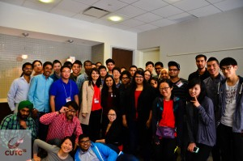
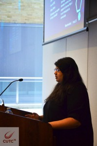

The [Canadian Undergraduate Tech Conference](https://twitter.com/cutc_team), also know as CUTC is aimed at Undergrad students interested in Technology, bringing together a group of Technology enthusiasts with backgrounds in Computer Science, Engineering, Business, Accounting and Design. It’s an excellent representation of the future, as every industry becomes more technologically influenced.

I attended CUTC in 2013 as a delegate. I had scored a free ticket for the event, along with a few friends, and so we made it out to the event. I think it was one of the first “big” tech event I had ever attended, with 500 delegates, numerous speakers and breakout sessions, as well as an impressive Skype presentation from Wolfram (you know, the guy who created , that thing we all use to help us solve math problems when no one is looking…). CUTC also hosted the second Hackathon I ever attended, and the first Hackathon where I actually coded something. Clearly, this event meant quite a lot to me, which is why I'm super excited to share that “I helped throw CUTC this year!”.

How I got involved with CUTC is a funny story filled with luck more than anything else. I was interning at Amazon last summer, and had been accepted to the People.Co hosted Tech Draft event. They picked the top 100 students in North America, flew them out to San Francisco and threw a new form of Recruiting, somewhat modelled after the NHL Draft Pick. As part of the event, I ran into Neha Sharma and we became good friends quickly. At some point, CUTC came up and she’d mentioned that she was Chairing the event for 2015, and got me on board to take part! I was officially the Social Media Co-Ordinator, and got to tweet and post on Facebook!

A challenge that we faced while planning this event is that most of the team hadn't met in person before since we were all in different schools and cities. This made it a little harder for us to sometimes meet, or get on the same page with an idea or concept. Unfortunately this also meant that many mistakes were made during the organization and planning of this event. This was one of those moments where the team had to either really pull up their socks and get stuff planned, or cancel the event all together. Based on the feedback we got from both delegates and speakers, I'm glad that we decided to go through with the event. I'm also a firm believer that every mistake is a learning opportunity, and definitely learnt a lot from this event.

I had originally signed up as the Social Media Co-ordinator, being responsible for our tweets and facebook posts, I ended up getting a lot more involved with the event than I had originally anticipated. During the planning stage, I had been asked to moderate the panel that we were planning to host. The panel was a great hit, and I had a fun time moderating it. The panelists spoke on a range of topics from their book reading preferences (e-readers vs. physical books) and things they do everyday, to in-depth backgrounds into where they work and why they chose to work there over other opportunities they had. At some point during the panel, we talked about things we do everyday, and I ended up talking about my #Project365 that I've been doing on Instagram for nearly a year now. Everyone seemed pretty moved by the idea, and asked to jump in and be part of my #Project365 for that day - this made me super happy!

Aside from the panel, I also presented as a speaker on how Hackathons have evolved the Tech industry. I gave a brief introduction and history on Hackathons as the expected demographics of the crowd would include both tech and business students. I then gave a brief history on hackathons, and described how they’re run today. I had a few minutes left in the end where we got heavily involved in a Q&A; session, and found out the next day that some of the delegates have signed up to help plan other hackathons that were coming up.

I think my favourite part of the conference was that it was smaller, and gave me an opportunity to get to know the participating delegates. The environment was very relaxed, and the discussions and interactions with the speakers were really interesting. I especially enjoyed the panel because we talked about such a wide range of things. I also loved that when it was time for our final keynote by Anthony D'Souza, he and I joked about taking the talk outside in the sun - and that's exactly what we did. Can you imagine having the final keynote of a conference sitting outside in the sun? It felt great!
