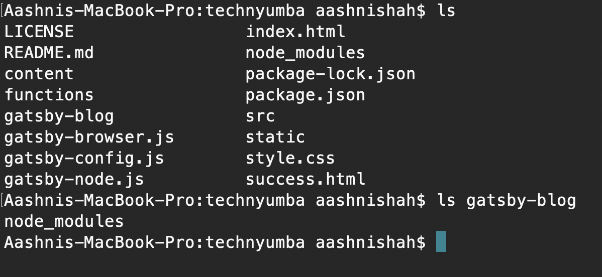
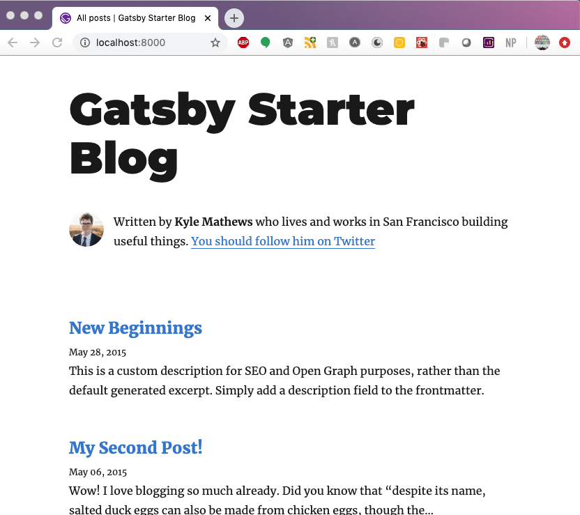
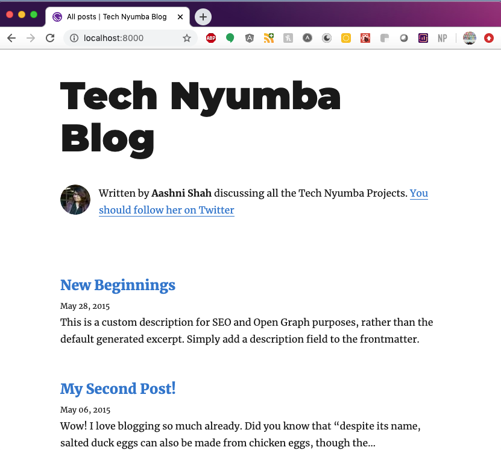
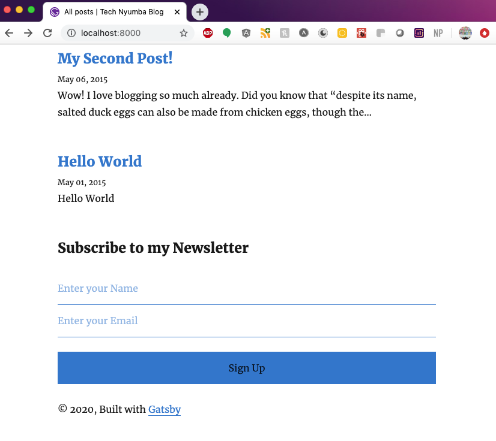
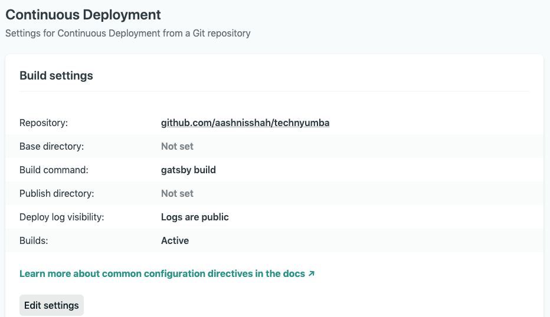

Many people are using this time to start their own personal site, and possibly even start a blog to go with it. A common question I've seen on twitter, facebook and in many of the slack groups I'm in is `what's the best way to start a blog`. Answers vary from self-hosting your site to using a [newsletter](https://aashni.me/newsletter) tool like SubStack, using a content management system (CMS) like Wordpress or using a blogging platform like Medium. These each have their own pro's and cons. I'm a huge fan of hosting your own site as you own 100% of your content, and can never get a paywall implemented on top of your content. Plus it allows you to have a lot more flexibility on how to show and style your site.

The largest downside of self hosting your blog is understanding how to setup and host your site, or even which framework or set of tools to use. My site used to be hosted on a self-hosted site using Wordpress as my CMS, however after many years of promising myself to update it, I finally took the plunge and started doing research. I eventually landed on using [GatsbyJS](https://www.gatsbyjs.org/) as my frontend framework, which also allowed me to start leveraging other tools such as [github](https://github.com/aashnisshah/aashnime) to manage my code and [netlify](https://netlify.com) to host my site. Do those sound familiar? Probably because those are the tools I used in my [_How to Setup and Host Your Site_](../how-to-setup-and-host-a-website-for-free) post. 

This guide will continue building on the simple HTML website I've been building in my past few [blog posts](../), where we have a simple HTML site that's already setup and configured with Github and Netlify. If you haven't already, I recommend going through the [first post](../how-to-setup-and-host-a-website-for-free).

## Why GatsbyJS
I looked at a few different platforms, and the two it came down to were [Hugo](https://gohugo.io/) and [GatsbyJS](https://gatsbyjs.org). Hugo is really fast, and that's a huge bonus as your site starts growing in the multi-thousand pages, however Hugo has a go-based templating system. Nothing wrong with Go, I just haven't tried it yet. Gatsby on the other hand was built on top of React, a framework I had just started to play with, and one I really enjoyed.

## How to Install GatsbyJS
Let's start by going to the terminal, and make sure we're in a directory for our project.

Our first goal is to install the gatsby CLI or command line interface. The CLI allows us to easily download, install and manage Gatsby projects. The easiest way to install Gatsby is to use a package manager such as npm. Check to see if you have npm installed:

```bash
npm -v
```

If you get back a version i.e. `6.14.4`, then you're good to continue. If not, follow [npm's guide to install npm](https://www.npmjs.com/get-npm).

Now we'll use npm to install the Gatsby CLI:

```bash
npm install -g gatsby-cli
```

The next command we'll run will install this [Gatsby Starter Blog](https://www.gatsbyjs.org/starters/gatsbyjs/gatsby-starter-blog/) template.

```bash
gatsby new gatsby-blog https://github.com/gatsbyjs/gatsby-starter-blog
```

## Moving The Files
If you started your site from scratch, you can decide now if you want `gatsby-blog` to be the root. If not, then move the files inside `gatsby-blog` to wherever you want the root of the blog directory to be. You can then skip the rest of the steps in this section.

If you've been following along with my series of posts on building a site, then we have a couple of quick updates we need to make before the site will work perfectly. Verify your file structure matches the structure I have. Specifically, run `ls` and `ls gatsby-blog` to print out a list of all the files in the current folder you're in and the `gatsby-blog` folder. This image shows what is currently in my two files.



Hopefully your file structure is the same as mine - all your files are in your root folder except for the `node_modules` which are in the `gatsby-blog` folder. We want to delete the `node_modules` folder and sub folders using `rm -rf gatsby-blog/node_modules/`, then delete the `gatsby-blog` folder.

```bash
rm -rf gatsby-blog/node_modules/
rm -rf gatsby-blog
```

## Run Gatsby Locally
We can finally move on to running Gatsby locally and make sure your site is configured properly. We need to install the node packages using `npm install`, then use `gatsby develop` to run the blog.

```bash
npm install
gatsby develop
```

Once everything is built, you can go to [https://localhost:8000/](https://localhost:8000) and your site will be live!



## Let's Make It Personal
Yay, the site is working - now let's make it personal! Additionally, you may have noticed that we lost our contact form or newsletter subscription form if you had previouslly followed the posts on [adding a contact form](../how-to-add-a-contact-form-to-your-website-for-free/) or using that contact form to [create a newsletter subscription list](../add-newsletter-to-your-site-using-buttondown/), we'll add those features back in too.

We'll start in the `package.json` file. Open it up in your editor, and update the following fields like I have below.

```javascript
  "name": "Tech Nyumba Blog",
  "private": true,
  "description": "A blog for the upcoming wonders of Tech Nyumba",
  "version": "0.1.0",
  "author": "Aashni Shah <technyumba@gmail.com>",
  "bugs": {
    "url": "https://github.com/aashnisshah/technyumba"
  },
```

Slightly further down in the file, I also updated the `homepage` and `repository.url` to point to my repository: [https://github.com/aashnisshah/technyumba](https://github.com/aashnisshah/technyumba).

Next open up the `gatsby-config.js` file. These are configurations specific to your gatsby project. We want to update the `sitemetadata`. Here is what my updated version looks like:

```javascript
  siteMetadata: {
    title: `Tech Nyumba Blog`,
    author: {
      name: `Aashni Shah`,
      summary: `discussing all the Tech Nyumba Projects.`,
    },
    description: `A blog to discuss Tech Nyumba projects.`,
    siteUrl: `https://technyumba.com/`,
    social: {
      twitter: `technyumbaorg`,
    },
  },
```

If you need to change the gender from `him` in the `You should follow him on Twitter`, you can do so in the `src/components/bio.js` file, close to the bottom.

The final change to make here is the profile picture. Find a picture you want to use, then replace the existing one which can be found at `content/assets/profile-pic.jpg` 

If you reload your site, you'll see these changes have taken effect already!



## Add Contact Form and Newsletter back
If you followed the [adding a contact form](../how-to-add-a-contact-form-to-your-website-for-free/) or using that contact form to [create a newsletter subscription list](../add-newsletter-to-your-site-using-buttondown/) posts that came earlier in this series, we'll be reusing what we had setup. Specifically, the `submission-created.js` page stays as is, and all the setup we did with Netlify and Buttondown also still exists. We just need to add the form, associated styling and a `success` page back.

The following code is the HTML code we used to add a contact form in the earlier blog post. Open up the `src/components/layout.js` file, then find the `<footer>` tag. We'll paste the HTML code here so that the newsletter contact form is at the bottom of the page. Also include a header at the top if you want one.

```html
<h3>Subscribe to my newsletter</h3>
<form
  netlify
  name="contact"
  data-netlify-honeypot="bot-field"
  action="success"
>
  <input
    class="form-control valid"
    name="name"
    id="name"
    type="text"
    onfocus="this.placeholder = ''"
    onblur="this.placeholder = 'Enter your Name'"
    placeholder="Enter your Name"
  />
  <input
    class="form-control valid"
    name="email"
    id="email"
    type="email"
    onfocus="this.placeholder = ''"
    onblur="this.placeholder = 'Enter your Email'"
    placeholder="Enter your Email"
  />
  <input
    class="hidden"
    name="bot-field"
    placeholder="Don't fill this out if you're a human"
  />
  <button type="submit" class="button button-contactForm boxed-btn">
    Sign Up
  </button>
</form>
```

Here is the updated CSS styles. They are largely the same as the previous tutorial, however I made a few modifications so that it fit the style of the gatsby starter blog better.

```css
.content {
  padding: 10px;
  margin: 10px;
}

.form {
  width: 100%;
}

input:focus,
select:focus,
textarea:focus,
button:focus {
  outline: none;
}

label,
input {
  display: block;
  width: 100%;
  border: none;
  border-bottom: 1px #007acc solid;
}

label {
  margin-top: 0.5rem;
}

::placeholder {
  color: #007acc;
}

input {
  font-size: 1rem;
  padding: 0.8rem 0em;
}

button {
  background-color: #007acc;
  display: block;
  border: none;
  width: 100%;
  font-size: 1rem;
  padding: 0.8rem;
  margin-top: 1.5rem;
}

.hidden {
  display: none;
}

```

When we ran the gatsby starter blog, we overwrote the `dotenv` requirement needed to pick up environment variables. We need the environment variable to configure the Buttondown email. To add this back in, open up the `package.json` file and add `"dotenv": "^8.2.0",` to the `dependencies` list.

Finally, we want to create the success page. Unfortunately copying the `success.html` page directly wont work. Instead we need to create a new `page` using Gatsby's structure. Feel free to venture and try replicate one off the `404.js` or `index.tsx` files found in the `components/pages` folder. Alternatively, use the code below. Save this in a file called `success.js`.

```javascript
import React from "react";
import { Link, graphql } from "gatsby";

import Layout from "../components/layout";
import SEO from "../components/seo";

class SuccessPage extends React.Component {
  render() {
    const { data } = this.props;
    const siteTitle = data.site.siteMetadata.title;

    return (
      <Layout location={this.props.location} title={siteTitle}>
        <SEO title="Aashni" />
        <h1>Success!</h1>
        <p>Yay! Your form was submitted successfully!</p>
        <p>
          Why not read some <Link to={"/"}>blog posts</Link> in the meantime?
        </p>
      </Layout>
    );
  }
}

export default SuccessPage;

export const pageQuery = graphql`
  query {
    site {
      siteMetadata {
        title
      }
    }
  }
`;
```

This is what the newsletter form looks like.



## Push the Site to Github and Netlify
To get this site hosted, we need to commit our changes to Github, then let Netlify pickup the new changes and deploy them for us. If I now go to [www.technyumba.com](https://technyumba.com), I'll see my brand spanking new site!

Run `git status` to see which files have changed. Then add every added file using `git add [filename]`. Then commit and push the changes to github.

```bash
git status
git add README.md package-lock.json package.json style.css .cache/ LICENSE content/ gatsby-browser.js gatsby-config.js gatsby-node.js public/ src/ static/
git commit -m "Setting up a blog with Gatsby"
git push
```

One final step we need to do is update the deploy command on Netlify. If you remember from earlier, the deploy settings are the commands that Netlify runs when it starts building and deploying your files. We previously had `npm install`, however we now need to change it to `gatsby build` so that we can build the Gatsby files. On Netlify, go to Settings, then the Continuous Deployment option. From here, update the `Build command` to `gatsby build` as shown in the image below.

