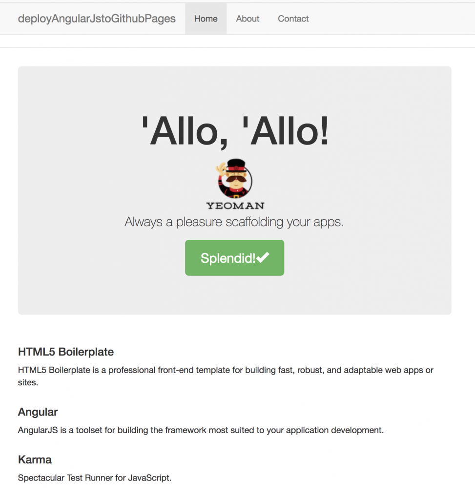

Recently I was working on an [AngularJS](https://angularjs.org/) project for an [Elixir Labs](http://www.elixirlabs.org/) project, and realized that I could actually host the entire website on Github Pages. This worked because my app made use of [Firebase](https://firebase.google.com/) as the database, and as a result didn’t need an additional back-end written up. I thought it would be a good idea to write-up a quick guide on how to create and then deploy an AngularJS app to Github Pages.

## Step 1: Setup our environment

The first step is making sure you have the necessary tools to create an AngularJS application.

We’ll be using [NodeJS](https://nodejs.org/en/). Check to make sure it’s installed by checking what version you have running. If you don’t get a version number back, visit the website and download NodeJS.

    
    
    $ node -v
    

Next we want to set up [npm](https://www.npmjs.com/) or the node package manager. This helps manage and control the different packages we’re using across a project. A general comment: whenever we use these commands, if we use `-g`, it means we’d like to make that package or service available globally on our machine, otherwise it would be project specific. The following command will install and update npm, and make sure it’s available globally.

    
    
    $ npm install npm -g
    

We’ll want to install [Yeoman](http://yeoman.io/) next. This let’s us use a generator for the AngularJS app, making creating controllers and services a lot easier. We will then install the angular generator.

    
    
    $ npm install -g yo
    $ npm install -g generator-angular
    

## Create the AngularJS App

Once the environment is set up, our next steps are to create our project directory, changing into it, then getting the project setup with Github. Replace  with your project’s name. You can get your  from the project’s repository page on Github. Add the initialized directory, commit and push the changes to your Github repo to make sure everything is working.

    
    
    $ mkdir <projectname> && cd $_
    $ git init
    $ git remote add origin <project-repo.git>
    $ git add *
    $ git commit -m "setting up environment for AngularJS project"
    $ git push --set-upstream origin master
    

Next we’ll use the Yeoman generator to create the AngularJS project for us.

    
    
    $ yo angular projectName
    

Yeoman will walk you through a set of questions in order to set up your project properly. I said no to Gulp, Sass/Compass and said yes to Bootstrap. I left the rest on their default values. If you’re asked to overwrite the package.json file at some point during this process, select Y or yes. You’ll see something similar to the following message at the bottom of the script to let you know the command completed successfully.

    
    
    Done. Phantomjs binary available at /Users/aashnishah/dev/deployAngularJSToGithubPages/node_modules/phantomjs-prebuilt/lib/phantom/bin/phantomjs
    + jasmine-core@2.9.1
    + phantomjs-prebuilt@2.1.16
    + karma-phantomjs-launcher@1.0.4
    + karma@2.0.0
    + karma-jasmine@1.1.1
    added 587 packages in 51.916s
    

Once this command completes, a base version of the app is ready to deploy. At this point, you’d go into your AngularJS app, make whatever necessary changes you want to make the website your own. You can run the following command to view the changes. Normally a new browser will pop up at this point, but incase it doesn’t, go to [http://localhost:9000/#!/](http://localhost:9000/#!/) in your browser.

    
    
    $ grunt serve
    

If all went well, you’ll see something similar to this on your screen.

## Deploy, Deploy, Deploy!

Once you’re done with all your changes, we can now deploy the app to [Github Pages](https://pages.github.com/). I recommend checking out their website if you don’t know much about how Github Pages work, but a quick overview is that you create a new branch called gh-pages, and push your changes to that branch. Github then picks up those changes and does it’s best to render it into a website at an address similar to .githubio.com. To deploy the AngularJS app, we want to build the dist or distribution version of the files, and then use those for the Github Pages.

In order to make this process easier for us as a developer, we’ll be making use of the [Grunt Build Control](https://github.com/robwierzbowski/grunt-build-control), and add a few changes to our existing project to automate and simplify the deployment process. You can follow their README for all the necessary steps and to add any of the additional options. I’ve highlighted the one’s needed for our simple base AngularJS app below.

    
    
    $ npm install grunt-build-control --save-dev
    

First we’ll need to add reference calls to grunt build control in our Gruntfile.js. We can add this close to the top of the file (right after we’ve created the module).

    
    
    grunt.loadNpmTasks('grunt-build-control');
    var pkg = require('./package.json');
    

This next section is adding in the rules so that we can call `grunt buildcontrol:pages` and have it all work. This needs to be added into the grunt.initconfig() - make sure you are careful about opening and closing different blocks of rules within the initconfig. Make sure to update the path to your remote repository.

    
    
    buildcontrol: {
          options: {
            dir: 'dist',
            commit: true,
            push: true,
            message: 'Built %sourceName% from commit %sourceCommit% on branch %sourceBranch%'
          },
          pages: {
            options: {
              remote: 'git@github.com:<username>/<githubrepo>.git',
              branch: 'gh-pages'
            }
          },
          local: {
            options: {
              remote: '../',
              branch: 'build'
            }
          }
        },
    

If you haven’t already, add, push and commit all these changes to GitHub.

    
    
    $ git add *
    $ git commit -m "Initial version of AngularJS ready to deploy"
    $ git push
    

At this point, we can now build the dist files needed to deploy the AngularJS app to Github pages. The following two commands will first create the dist folder, and then use the build control we set up earlier to push the changes to Github Pages

    
    
    $ grunt build
    $ grunt buildcontrol:pages
    

If this is your first time using GitHub like this, you may run into the following error message while running the buildcontrol:pages command. You’ll need to follow [these steps](https://help.github.com/articles/connecting-to-github-with-ssh/) on how to setup SSH keys between your computer and Github, and then try the command again.

    
    
    Pushing gh-pages to git@github.com:aashnisshah/deployAngularJSToGithubPages.git
    no such identity: /Users/aashnishah/.ssh/id_rsa: No such file or directory
    git@github.com: Permission denied (publickey).
    fatal: Could not read from remote repository.
    
    Please make sure you have the correct access rights
    and the repository exists.
    Warning: no such identity: /Users/aashnishah/.ssh/id_rsa: No such file or directory
    git@github.com: Permission denied (publickey).
    fatal: Could not read from remote repository.
    
    Please make sure you have the correct access rights
    and the repository exists.
     Use --force to continue.
    

A gh-pages branch will be created in your repo, and you can now view your website at the following link:

    
    
    http://<username>.github.io/<projectname>
    

You can view my project at: [aashnisshah.github.io/deployAngularJSToGithubPages](https://aashnisshah.github.io/deployAngularJSToGithubPages/).

Managed to deploy your project or have any questions? Leave them below!
