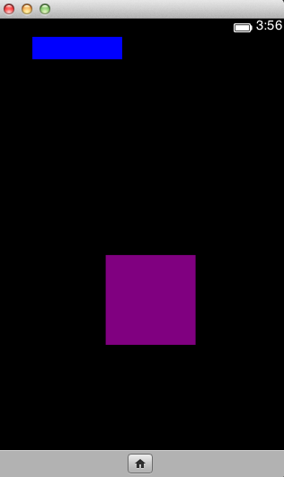

This week has been extremely busy in terms of getting caught up with assignments, and getting ready for the "hell week" I have coming up (2 midterms, 3 assignments all due next week...), so I haven't had a chance to work on any of my personal projects. I did, however, attend a FireFox OS Apps Day two weeks ago, which I haven't talked about yet.

The FireFox OS Apps Day was held to show potential programmers about FireFox's upcoming Phone OS, and give developers a chance to start developing apps for their marketplace. I didn't know about the phone coming out until I heard about the Apps Day, and must admit that I like the phone, and am totally in support of their reasoning to make the phone. Which programmer wants to re-code and re-design their entire program multiple times just so that it can be run on multiple platforms? iOS, Mac, iPad, Blackberry, Android, Kindle, Kobo etc. Firefox's vision is to create a phone where "if it works on the web, it'll work on the phone". The entire OS is based on HTML5, CSS3 and JavaScript, and so will all the apps.

The day started pretty early (9am, which is really early for me..), and we got breakfast. We then had an introduction to the new phone, explaining why it's great and why FireFox decided to build it. This was then followed by giving us all a chance to hack away and make something for their new phone. They had provided us with a bunch of great resources that would allow us to test and build apps, and were extremely helpful if we had any questions when it came to App Development for their OS.

I spent the first hour or two trying to figure out how to connect to a database, since I thought I could start working on one of the "secret projects" I've been thinking about. To my dismay, it would require levels of understanding that I wouldn't be able to master in the time we had. I decided to jump ships and try my hand at making a game based on one of the resources that they had provided us, and thus Block Wars was created. Remember, I'm a novice at making games, and this time I was trying to do it in JavaScript - something I have little to no practice with. I managed to figure out how to move the pieces around the screen, and how to get the pieces to grow in size etc.

The aim of the game is to get your piece (the purple one) into the blue piece before you get too big. As the levels went on, it would become harder where you would either have obstacles to overcome, or the landing zone was moving and changing sizes etc. I only managed to make the first two levels, and was working on the third one, but I'd made some prettty great progress and liked how my game was shaping up.

I'd run into an interesting problem where the game would work on the phone simulator (set up through the FireFox Browser), but had strange glitches in the browser. Interesting...

This is definitely one of the on-going projects that I plan to work on, and hope that I'll be able to finish the game, even though it is pretty simplistic. Here's a screenshot of the game being run on the phone simulator, followed by a link to the github repo where the codes are stored. It needs quite a bit of work, so we'll see what happens.

[GitHub to Block Wars](https://github.com/aashnisshah/blockWars)
