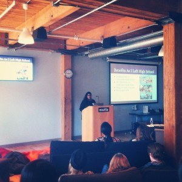
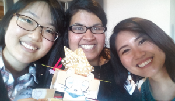
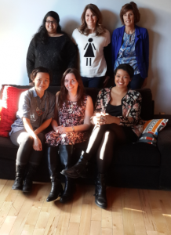

The FITC Womens Mix and Make social was hosted by [Pearl Chen](https://twitter.com/pearlchen) and [Caroline McGregor](https://twitter.com/carolinemcgrgr) at the beautiful [Mozilla](https://twitter.com/mozilla) office and sponsored by [Intel Canada](https://twitter.com/intelcanada). [FITC](http://fitc.ca/) is all about Future, Innovation, Technology and Creativity. It’s a 3 day conference with incredible talks by speakers from all around the world. I’ll be writing another blog about my time and experience there soon!

    
    Hey Aashni, what are you doing the afternoon of Apr 11th? Would you be interested in giving a 10 minute lighting talk at a women in tech event that I'm organizing?

That’s the email I got. After a considerate amount of [jumping up and down in joy](https://twitter.com/aashnisshah/status/574735631277916160) (fortunately I wasn’t in a very public place), I replied expressing my interest! After a few emails back and forth, I found out more about the event and had a rough idea of what I was going to talk about.

So what did I talk about? The title of my lightning talk was **Learning By Planning**, with the synopsis being **my introduction to tech, how I took charge, planned events and everything I learnt along the way.** Essentially, it was about how I got involved with different clubs and started helping plan events, and how I learnt more about both event planning/clubs, as well as about the tech field. I also shared that it’s a great way to learn more about your own interests, and find new people who have the same interests. I was super excited, but definitely nervous, and felt so relieved when everyone started laughing when they saw my giraffe selfie. Things went smoothly after that (I hope).

There were five inspirational women giving lightning talks that day. Here are one or two pointers that I’d like to share from each of them.
[Caroline McGregor](https://twitter.com/carolinemcgrgr) shared how to have a strong power stance, and how to use this to increase confidence. She also shared a fascinating story on the race to the South Pole, and how the smartest strategy is to prepare, and prepare well.
[Karen Schulmun Dupuis](https://twitter.com/karensd) spoke about her life experiences as a woman in tech and especially realizing her self worth.
[Ashley Jane Lewis](https://twitter.com/AshleyJaneLewis) spoke about some of the 3D printing work she’s doing. She also shared the story of a little girl making a gift for her brother at one of her workshops, which sparked her interests in using 3D printing for story-telling.
[Nancy Demerling](https://twitter.com/NancyDemerling) shared how technology can help connect all different generation gaps, and reminded us that technology has the ability to change the lives of our loved ones, and that we should spend time explaining how to use technology to our grandparents and parents.

The talks were all amazing, and brought so much inspiration and excitement into the room. After the lightning talks, we were going to work on a hands-on hacky project, but before it started Pearl said something really great. I paraphrase as I don’t remember the proper quote, but it was something along the lines of _“Picking speakers is hard, and I wish I could hear from all of you. I’m hoping to spend some of this afternoon getting to know more of you and hear your inspirational stories too.”_ That really stuck with me, and is an excellent reminder that everyone has their own story, and that every story can be inspirational.

There was such a positive buzz in the air, and everyone got extremely excited when Pearl announced the afternoon activity. We were going to hack together an obstacle avoiding robot cat! People teamed up into groups of 3 and started on the ‘easy’ adventure of putting together the robot cats. I spent the time ‘mentoring’ participants, which really meant that I was distracting them by chatting with them instead of helping them out - oops. I was definitely touched as many women asked me some follow up questions from my talk, and extremely excited when they told me of their own adventures. I ran into many of these women over the next few days at FITC, which was awesome as it then became easy to find someone to chat with. Despite my best efforts to distract them, the women did an awesome job creating their robot cats, which then led to a hilarious onslaught of small robot cats taking over the Mozilla office.

