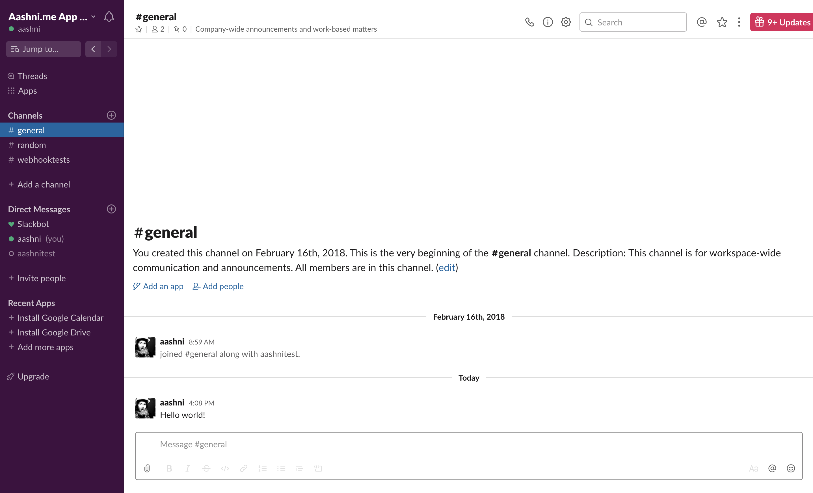
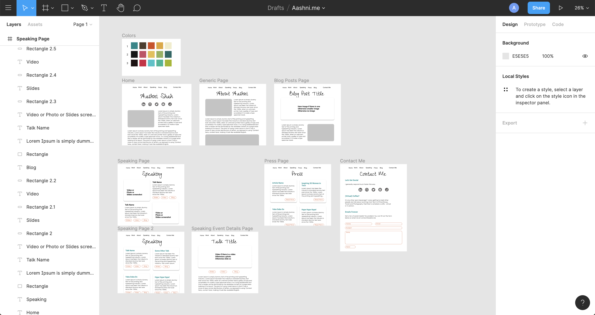
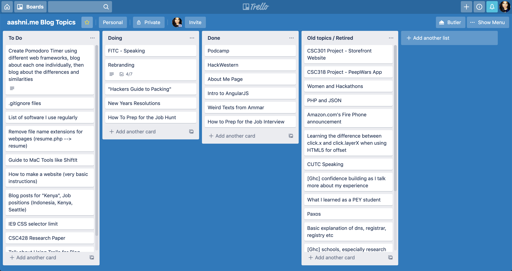
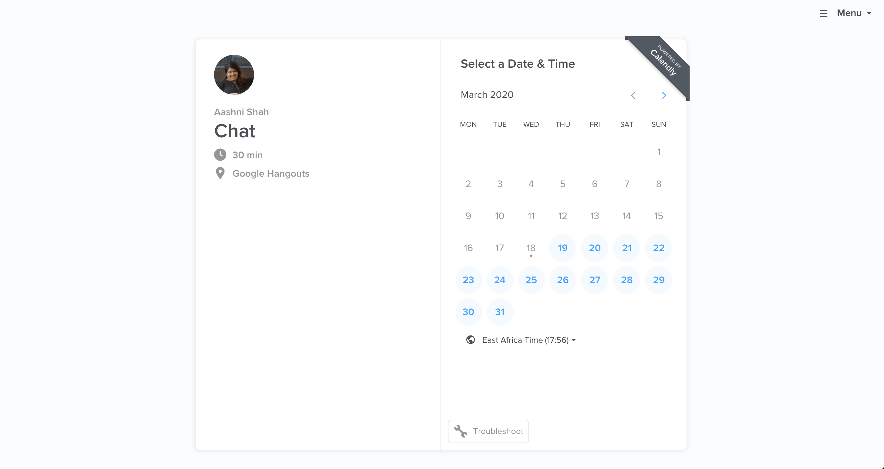
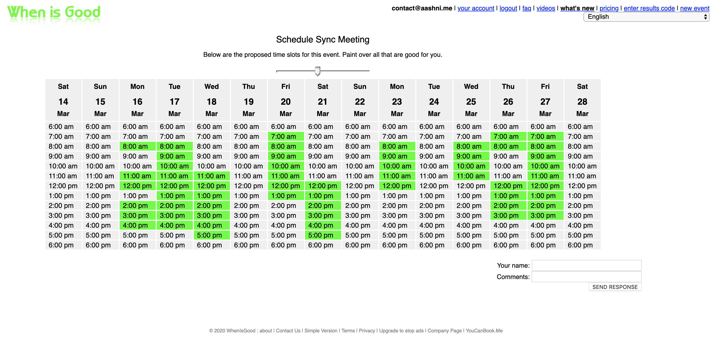
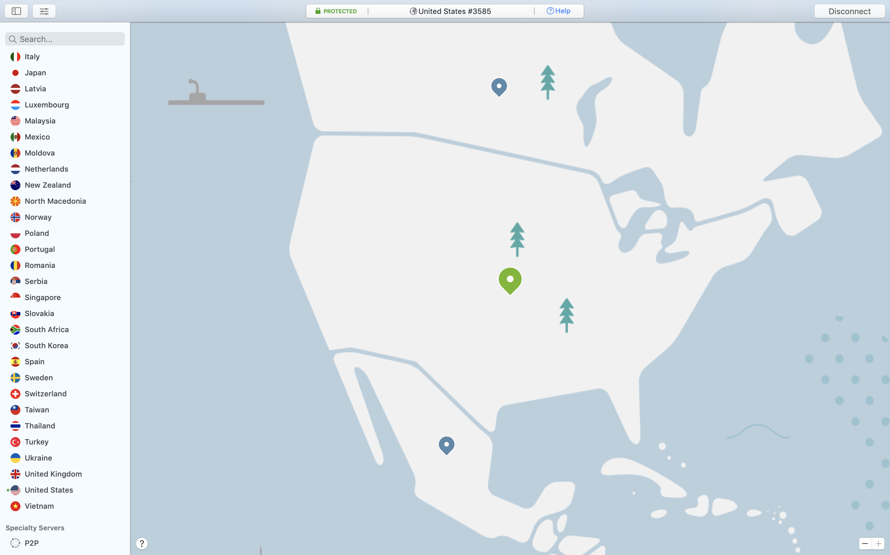

The news has been rather bleak the last few weeks with constant updates on the current [covid-19 pandemic](https://www.who.int/emergencies/diseases/novel-coronavirus-2019). Many companies have had to support remote work in efforts to flatten the curve and help reduce the spread of the infection. Large companies have the budget and ability to pay for expensive tools to keep their teams connected and productive, however many smaller and medium sized companies do not have the same luxury. Here are tools that we have been using at Elixir Labs for over 3 years in order to stay remote and productive.

For some context, [Elixir Labs](https://elixirlabs.org) builds custom products for non profits around the world, for free. The EL team is remote, crossing multiple timezones and on different continents. As a result, meeting face-to-face is not an option and so we heavily rely on the following tools to keep the team productive, while still delivering projects to non profit partners.

Just a note: these tools are tried and tested with a small team, however some tools charge a fee as the team size or use increases. I've listed alternative tools that I have used and recommend, however most of the alternative tools cost money.

## [Slack](https://slack.com)

Slack has become a staple tool in the communication space. Slack's public and private channels, as well as the 1:1 messaging options provide flexibility when discussing projects and work. One reason Slack is so powerful is the ability to add integrations, making communication even more seamless throughout the company. Some of the integrations Elixir Labs use include Google Drive and Trello. Slack also has the ability to start voice or video calls directly from their platform for free.

[@izzydoesizzy](https://twitter.com/izzydoesizzy) has written a great guide on [how to get started with slack](https://medium.com/@izzydoesizzy/how-to-set-up-remote-communication-with-slack-during-covid-19-945ce412ac81)

_Price:_ Slack has a free tier which is free forever for an unlimited number of users, however it only stores the most recent 10,000 messages.

_Alternatives:_ [Microsoft Teams](https://teams.microsoft.com/start), [Facebook Workplace](https://www.facebook.com/workplace), [Discord](https://discordapp.com/)

## [Google Meet](https://meet.google.com)

As long as the person initiating the call has a google email, you can create a video conference meeting. Meet allows you to invite folks outside your company domain or workspace. It also supports people phoning in for convenience. Other useful features include screensharing, making it a great way to collaborate with others, and the ability to automatically add the meeting details to a calendar invite.

_Price:_ Free if you have a google email.

_Alternatives:_ [Zoom](https://zoom.us/), [Skype](https://www.skype.com/), [Slack](https://slack.com)

## [Figma](https://www.figma.com/)

Figma is a really great and easy tool to use to create designs for your product, collaboratively. Files can be shared with engineers, who can quickly grab information like pixel sizes or font colors.

_Price:_ The free tier allows for upto 2 editors and 3 projects

_Alternatives:_ [Invision](https://www.invisionapp.com/), [Sketch](https://www.sketch.com/), [Adobe](https://www.adobe.com/creativecloud.html)

## [Trello](https://trello.com/aashnishah/recommend)

Trello is a simple drag-and-drop organizational tool that's perfect for keeping track of work. Quickly assign people to tickets, add comments, documents and descriptions to make them more informative and move them between different columns as a way to mark their current status.

_Price:_ Trello's free tier covers 10 Team boards with unlimited team members

_Alternatives:_ [Asana](https://asana.com/), [JIRA](https://www.atlassian.com/software/jira), [Airtable](https://airtable.com/), [ClickUp](https://clickup.com/?fp_ref=2lve1)

## [Calendly](https://calendly.com)

Scheduling 1:1 meetings is painful for so many reasons. With Calendly, simply share a link and the person your meeting can find a time that's convenient for them. Calendly is connected to existing calendars, so it accurately identifies the users availability and only lists free slots. Quickly confiugre Calendly to set a meeting location (i.e. a coffee shop), collect a phone number or automatically include a link to Google Meet/Hangouts or Zoom for a video call.

_Price:_ The free tier allows you to connect 1 calendar, and set 1 type of recurring event type (i.e. 30 min chat)

_Alternatives:_ [You Can Book Me](https://youcanbook.me/), [x.ai](https://x.ai/), [GoodTime](https://www.goodtime.io/)

## [WhenIsGood](https://calendly.com)

Oftentimes when running a remote team, there is a need to schedule meetings between multiple people. Instead of having numerous conversations and emails trying to identify a time everyone is free, use a tool like WhenIsGood. Each person can select and share the times they are available asynchronously, making it easy to identify which timeslots will actually work. WhenIsGood is definitely not the prettiest tool out there, but it's simple, quick and effective, and one I've been using for over 6 years.

_Price:_ Really great free tier.

_Alterntaives:_ [You Can Book Me](https://youcanbook.me/), [Doodle](https://doodle.com)

## [NordVPN](https://go.nordvpn.net/aff_c?offer_id=15&aff_id=38693&url_id=902)

This last option isn't free, but it's such an important tool at such an affordable price, that I'm going to include it anyway. VPN's or Virtual Private Networks are great at protecting the users data on a personal level. However as a company builds and grows their product, VPNs provide the ability to test how a product works in different countries and environments. It also allows team members in different countries to access tools that otherwise may be restricted in their home country.

I've been using NordVPN for a few years now, and it's extremely reliable, simple, and easy to use. I can use it on my laptop or phone while on the go, and select servers from over 50 countries. From a non-work perspective, it also let's me stream content or access geo-blocked content no matter where I am in the world. Additionally, they almost always have a 70% off sale making it the most affordable option I could trust - the price of a cup of coffee once a month!

_Price:_ \$3.49/month on a 3-year plan (70% discount from their usual rate)

_Alternatives:_ [ExpressVPN](https://www.expressvpn.com/), [TunnelBear](https://www.tunnelbear.com/)
