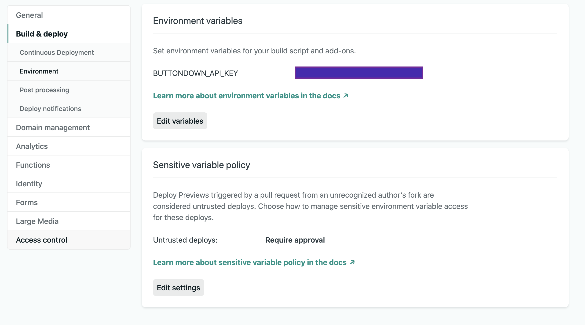

As we build apps, whether it's a Gatsby App to build a blog, or a backend NodeJS app for a messaging bot, we often need to make use of secret values or variables in the shape of an API key, password or general string. When we use tools like Github to host our code, this becomes a problem since these secrets are stored in our codebase and anyone can see it. This post will walk you through how to safely use environment variables to keep your secrets safe.

## What Are Environment Variables

Instead of defining it myself, I decided to let trusty ol' [Wikipedia](https://en.wikipedia.org/wiki/Environment_variable) to define it for me:

> An environment variable is a dynamic-named value that can affect the way running processes will behave on a computer. They are part of the environment in which a process runs. For example, a running process can query the value of the TEMP environment variable to discover a suitable location to store temporary files, or the HOME or USERPROFILE variable to find the directory structure owned by the user running the process.

Common convention is to use all caps when creating or referencing a variable, though it's not required. They exist as `NAME=value` pairs such as below. The value is a string, and can technically be anything that can be represented as a string.

```bash
API_KEY=top_secret_api_key_here
SOME_PASSWORD=pa$$word
```

## How To Use Environment Variables

Like with most development options, there are many ways you can use environment variables in your code. I'll be exploring the style where we use a `.env` file, and access the variables using the `dotenv` npm package.

Let's say we have the following in our codebase that stores an API Key, then uses the API key to generate the API Url.

```javascript
const api_key = `klavj09avlkjq3fjldvAv3av`
const api_url = `https://api.aashni.me/someapi/${api_key}`
```

The first thing we'd need to do is extract the environment variables into a `.env` file in your root folder. Create the file, then using the `NAME=value` practice, we can pull the `api_key` and `api_url` into the `.env` file. Be careful not to allow excess spaces.

```javascript
API_KEY = klavj09avlkjq3fjldvAv3av
```

We'll want to access these values off the `process.env` variable, which houses and tracks multiple process environment variables. Return to your code and replace references to the `api_key` with `process.env.API_KEY` instead.

```javascript
const api_url = `https://api.aashni.me/someapi/${process.env.API_KEY}`
```

## DotEnv

In order to get the values to live off `process.env`, we'll need to tell the app to append it to the existing data. In order to achieve this, we can make use of the npm [dotenv](https://www.npmjs.com/package/dotenv) package.

Install dotenv:

```bash
npm install dotenv
```

In some frameworks, like React or Gatsby, you can skip this next step as using `dotenv` is already setup and configured. A good way to test is to `console.log(process.env.API_KEY)` and see if the right value prints. If nothing prints then add this line to your code. Make sure it's added somewhere early on, where it will run before any environment variables may be called.

```javascript
require("dotenv").config()
```

The above code makes use of `dotenv`, and calls in the config. The default value will look for a `.env` file in the root directory, however if you have a file elsewhere in your files, you can provide a path to that file as follows:

```javascript
require("dotenv").config({ path: "/full/path/to/the/env/file" })
```

## Keep Them Secret with a .gitignore File

At this point, you may be wondering "hmm, we just pulled all our secret values and keys and put them into one easy-to-find place. How exactly is this more secure? The answer to that is **you don't store the .env file on github**. The `.env` file should remain local to your machine. If other folks are also working in this codebase, they'll need to generate their own `.env` files with values that relate to them.

To avoid adding it to Github, or whichever SVN tool you're using, add the `.env` file to the `.gitignore` file. Without going too indepth into how a `.gitignore` file works, it's a file to tell `git` which local files or folders to ignore when pushing your coedbase to your repository. If you already have a `.gitignore` file, take a look and see if `.env` is already in it - if it isn't, add it in on a new line. If you don't have a `.gitignore` file, then create one and add `.env` to it.

Commit the `.gitignore` file.

```bash
git add .gitignore
git commit -m "adding gitignore to avoid .env files"
git push
```

Now if you try run `git status`, you'll notice the .env file won't show up. **Your secrets are safe!**

## Using them in a deployed app

One last little bit to tackle. The secrets only exist on a `.env` file on your local machine - what happens when you deploy it?

Most deployment tools have an environment variable configuration option somewhere. With Netlify you can find it under Site Settings -> Build and Deploy --> Environment. If you're using a different provider, you should be able to quickly google how to update the environment variables on that system.

[](./environment-variables-01.png)

Simply add your `NAME=value` pairs, redeploy, and you'll be good to go!
