This is a follow up to my previous post on [how to setup and host a website for free](../how-to-setup-and-host-a-website-for-free). If you haven't already gotten your site setup and hosted with Netlify, I recommend following that post first. All code samples below will build on top of the previous codebase.

In this post, I'll walk you through how to create a contact form using [Netlify Forms](https://docs.netlify.com/forms/setup/). In my next post I'll talk about how you can convert the contact form into a subscription form that powers your own newsletter with [Netlify Functions](https://docs.netlify.com/functions/overview/) and [buttondown.email](http://buttondown.email/?utm_campaign=aashnisshah&utm_affiliate=affiliate).

_Note - as of writing this post, Netlify Forms allows 100 free emails a month, and ButtonDown.Email allows upto 1000 subscribers on their free plan_

## Using Netlify Forms to create a Contact Form

One of the many reasons I love Netlify is it allows you to turn a form on your site into a functioning contact form with only a few changes to your code.

Here's what our code currently looks like in our `index.html` page.

```html
<form>
  <input
    class="form-control valid"
    name="name"
    id="name"
    type="text"
    onfocus="this.placeholder = ''"
    onblur="this.placeholder = 'Enter your Name'"
    placeholder="Enter your Name"
  />
  <input
    class="form-control valid"
    name="email"
    id="email"
    type="email"
    onfocus="this.placeholder = ''"
    onblur="this.placeholder = 'Enter your Email'"
    placeholder="Enter your Email"
  />
  <button type="submit" class="button button-contactForm boxed-btn">
    Sign Up
  </button>
</form>
```

First we'll start by adding `netlify` as an attribute to your form tag, along with a `name` attribute that's set to `contact`.

```html
<form netlify name="contact">
  <input
    class="form-control valid"
    name="name"
    id="name"
    type="text"
    onfocus="this.placeholder = ''"
    onblur="this.placeholder = 'Enter your Name'"
    placeholder="Enter your Name"
  />
  <input
    class="form-control valid"
    name="email"
    id="email"
    type="email"
    onfocus="this.placeholder = ''"
    onblur="this.placeholder = 'Enter your Email'"
    placeholder="Enter your Email"
  />
  <button type="submit" class="button button-contactForm boxed-btn">
    Sign Up
  </button>
</form>
```

Head back to your terminal, add and commit your index.html file, then push it to github.

```bash
git add index.html
git commit -m "Add netlify attribute to activate Netlify Form submissions"
git push
```

Your code will get pushed to Github and because of the way we setup Netlify earlier, Netlify will automatically start building and deploying your updated website. This is what the Netlify overview page looks like for my [TechNyumba.com](https://technyumba.com) site.

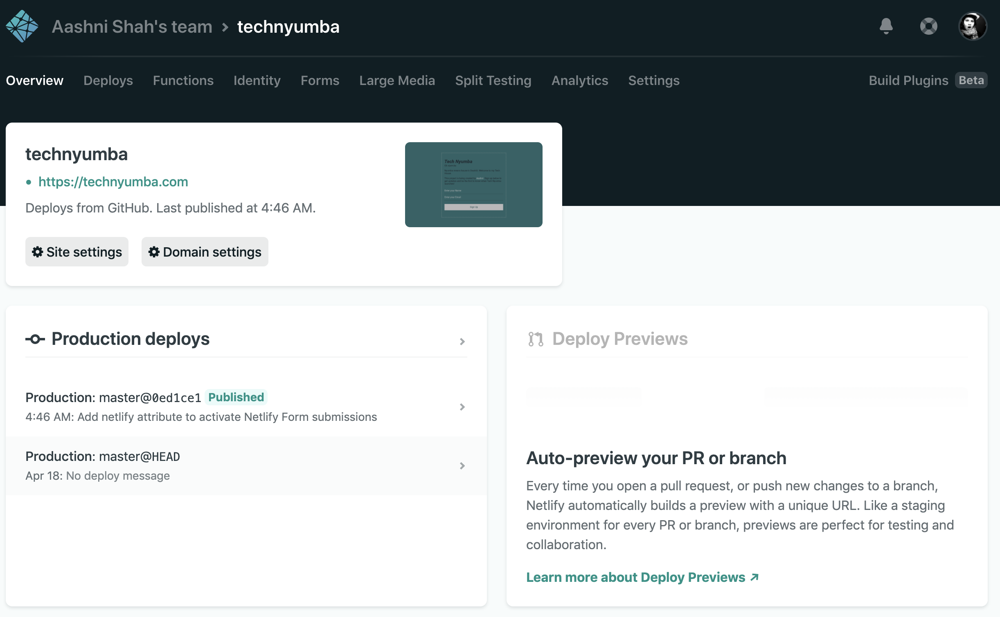

If you click on Forms within Netlify's header, you'll see the contact form appear here. Like magic!

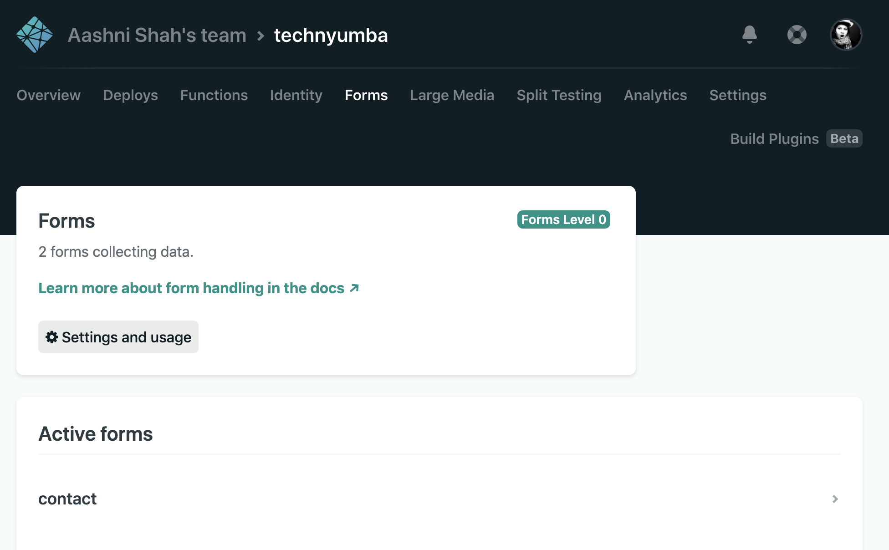

We could do a quick test now to make sure form submissions actually work. Go to your website, fill in a name and email, then check the form submission to make sure it correctly appears there. You'll see a confirmation screen on your site powered by Netlify - we'll build something custom to replace that soon.

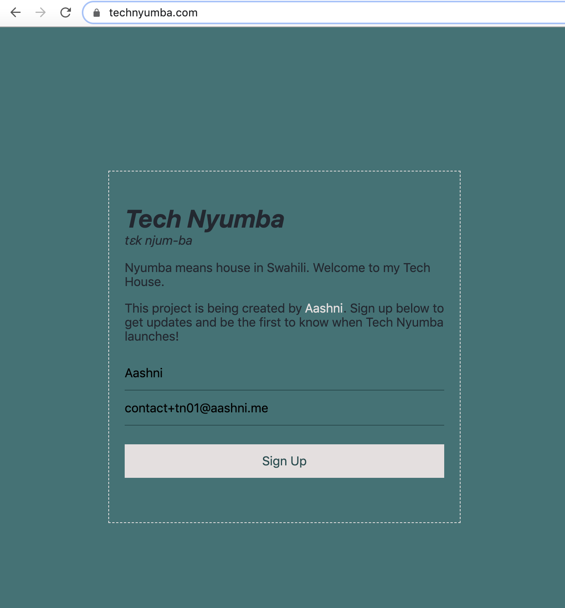

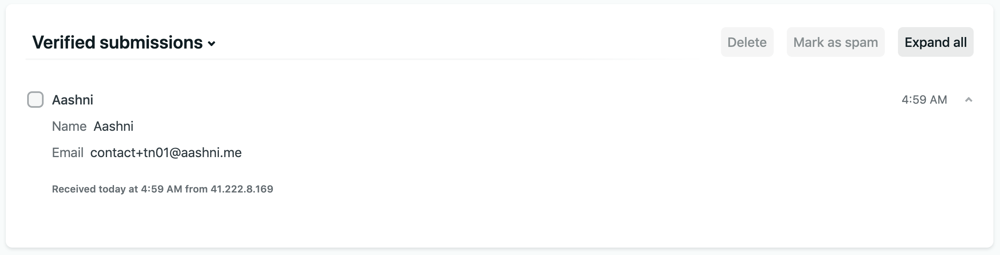

Woot! Your form is alive! There are three more changes I want us to focus on, namely spam control, a better success message for folks submitting an entry and getting emails to your inbox.

## Add Spam Control to your Form

Netlify Forms gives us the option of using Honey Pot fields. It's a way to add an invisible field that works as a `trap` for bots. Netlify will automatically ignore any submissions that submit something to the honeypot field. First add `data-netlify-honeypot="bot-field"` as an attribute to your `<form>`.

Next we'll want to add the honeypot input field to your input form. Add a `hidden` class to the field, so that we can use CSS to hide the field from real users.

```html
<input
  class="hidden"
  name="bot-field"
  placeholder="Don't fill this out if you're a human"
/>
```

```css
.hidden {
  display: none;
}
```

_Note: We add the placeholder `Don't fill this out if you're a human` incase anyone using a screenreader comes across your site and wants to submit the form_

The website looks the same since we hid the bot-field.

## Build a Better Success Page

Next up, we'll create a `success.html` page to act as our success message after a form has been submitted. In the form, simply add an `action` attribute to the `form` tag, and set the value to `success` without the `.html` extension - `action="success"`

This is what the form's code looks like now after both updates above.

```html
<form netlify name="contact" data-netlify-honeypot="bot-field" action="success">
  <input
    class="form-control valid"
    name="name"
    id="name"
    type="text"
    onfocus="this.placeholder = ''"
    onblur="this.placeholder = 'Enter your Name'"
    placeholder="Enter your Name"
  />
  <input
    class="form-control valid"
    name="email"
    id="email"
    type="email"
    onfocus="this.placeholder = ''"
    onblur="this.placeholder = 'Enter your Email'"
    placeholder="Enter your Email"
  />
  <input
    class="hidden"
    name="bot-field"
    placeholder="Don't fill this out if you're a human"
  />
  <button type="submit" class="button button-contactForm boxed-btn">
    Sign Up
  </button>
</form>
```

I used the following code to create the `success.html` page. Just like your own website, you can style it however you'd like.

```html
<!DOCTYPE html>
<html class="no-js" lang="zxx">
  <head>
    <meta charset="utf-8" />
    <meta http-equiv="x-ua-compatible" content="ie=edge" />
    <title>Tech Nyumba | Created by Aashni</title>
    <meta name="description" content="" />
    <meta name="viewport" content="width=device-width, initial-scale=1" />

    <!-- CSS here -->
    <link rel="stylesheet" href="style.css" />
  </head>
  <body>
    <div class="container">
      <div class="content">
        <h1>Form Submitted</h1>
        <p>
          Thank you for submitting the form.
        </p>
        <p><a href="./index.html">Return home</a></p>
      </div>
    </div>
  </body>
</html>
```

I also made two tiny changes to the `.container` CSS to balance the overall style of the site. Specifically I removed the height, and added a padding-bottom.

```css
.container {
  background-color: #357376;
  width: 450px;
  position: absolute;
  padding-bottom: 20px;
  left: 50%;
  top: 50%;
  transform: translate(-50%, -50%);
  border: 1px dashed #e5dfdf;
}
```

This is what the `success.html` page should look like.

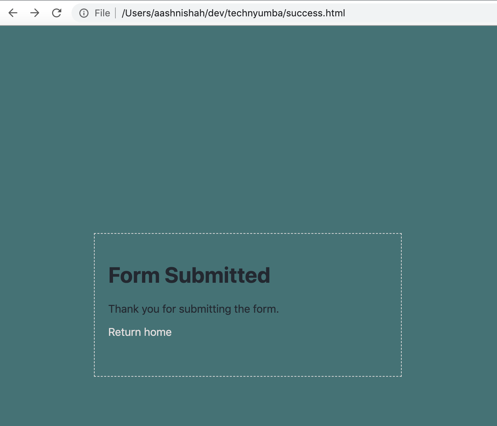

Now we can go back to the terminal and add, commit and push our changes to github so they get deployed.

```bash
git add index.html success.html style.css
git commit -m "Adding honeypot for spam bots and a success page"
git push
```

Once the site is loaded, we can go ahead and test the form out to make sure it's still working, and that we get redirected to our custom `success.html` page.

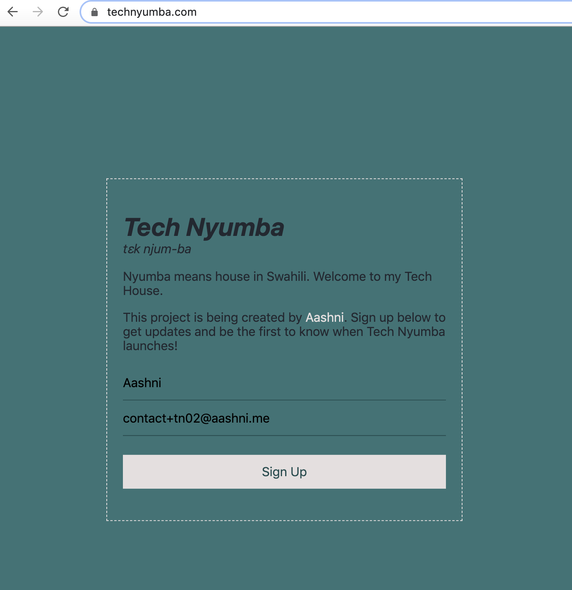

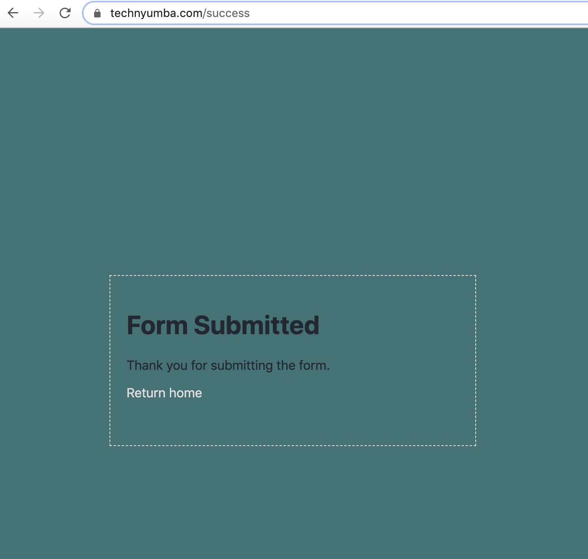

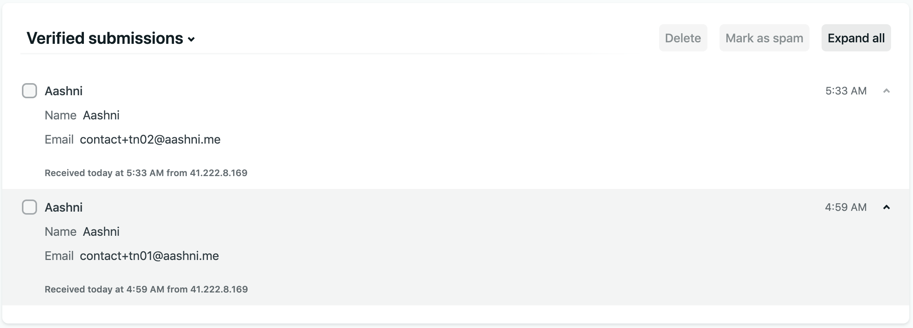

So much power with such little code! But wouldn't it be even better if we could get these emails straight in our inboxes instead? Netlify is way ahead of you!

## Forward form submissions to your email

On the Netlify Forms page, select `Settings and Usage`, then scroll down to the `Form Notifications` section.

<!--  other images dont load locally without this line -_- -->

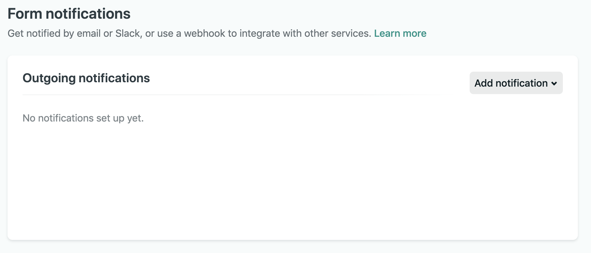

Select the `Add Notification` dropdown, then select the `Email Notification` option.

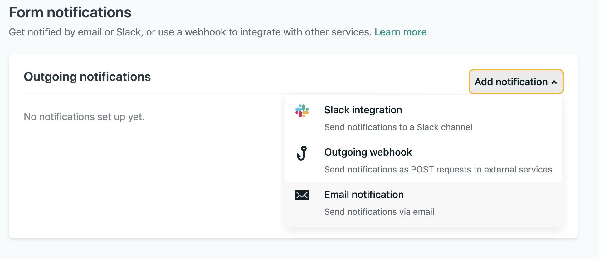

Then fill out the form with your emails. You can either select all form submissions to be forwarded to your email, or only the contact form.

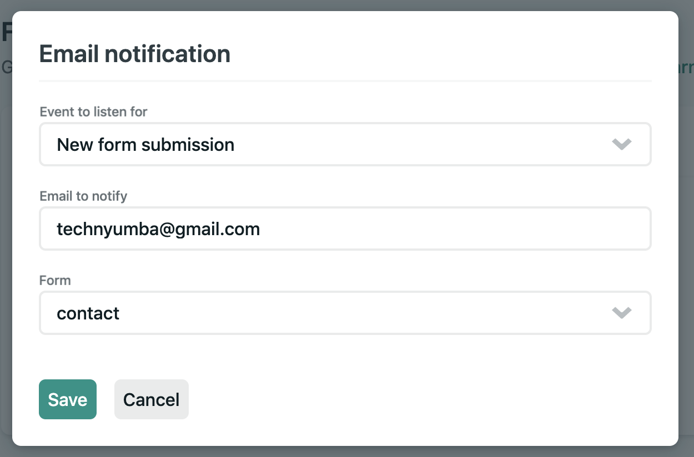

I submitted another test form, and voila! It went straight to my inbox!

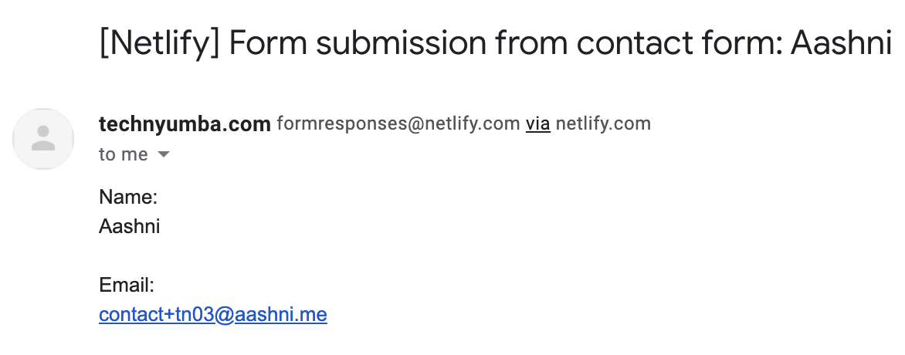

If this guide helped you, I'd love to know. Please consider [tweeting](https://twitter.com/aashnisshah) me, especially links to your sites once they're setup!

[Subscribe to my newsletter](https://aashni.me/newsletter) to get my future blog posts straight into your inbox! My next post will talk about how to turn this contact form into a subscription form to let people register for your newsletter - also still for free!
