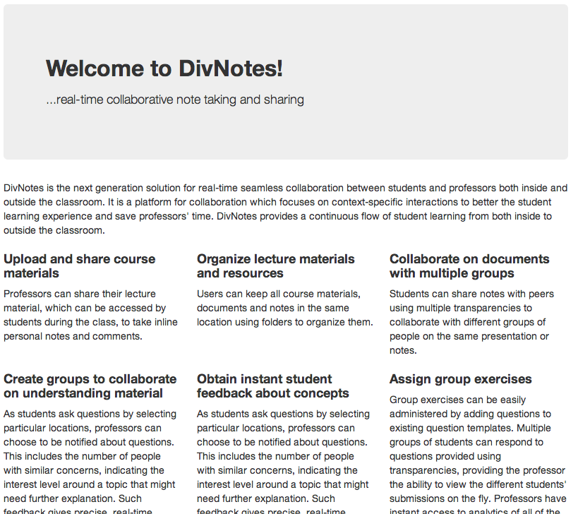
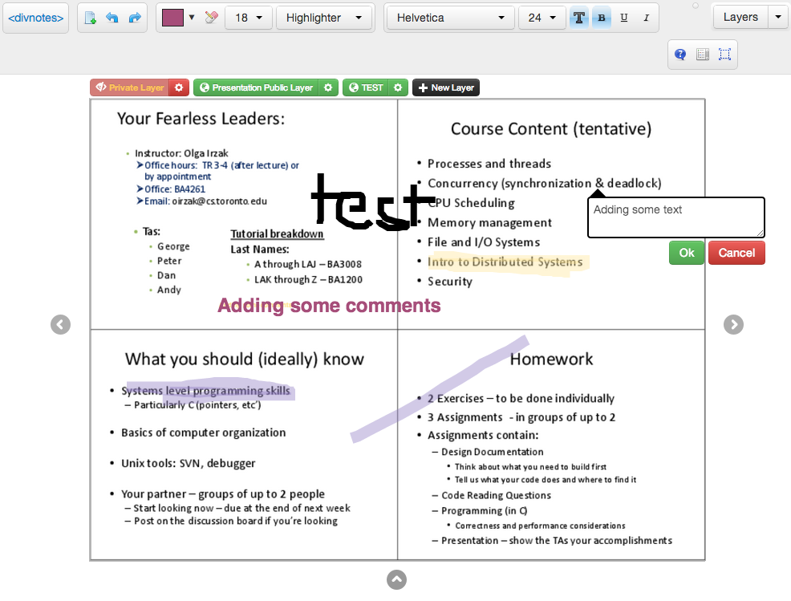
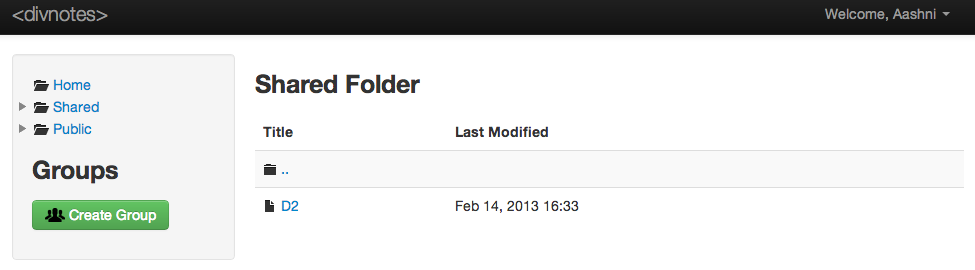

On Thursday I got a request to come out and be an Alpha Tester for a project that some friends have been working on. I felt pretty honoured that they wanted me to test it out, and promised I'd do my best to make it. I got to the lecture hall where they were presenting the project, and was pretty impressed. They're creating an alternative way for students and professors to interact in a classroom in the form of note-taking (and eventually more in the future).

I introduce to you [divNotes](http://www.divnotes.com), a real-time collaborative note taking and sharing application. It let's you:

- Upload and share course materials

- Organize lecture materials and resources

- Create groups to collaborate on understanding material

- Obtain instant student feedback about concepts (includes anonynimity)

- Assign Group Exercises

- Access questions asked by other students

- Ask a question by slide location

DivNotes combines the best of a blackboard/whiteboard and using projected slides by letting professors draw directly onto the slides without having to buy some of the expensive hardware (such as those needed with smart boards). It also lets students draw and write directly onto the slides, save the pdf's for later use, and have multi-layers on the slides so you can distinguish between your notes and the profs.

I spent some time playing around with it, and sent some (hopefully useful) feedback. One of the reasons I'm really happy that I went for the Alpha Testing was because it showed me: "Look, someone **you know** created an app, a product that they're going to make live soon." It gave me a huge inspirational boost to start working on my projects a bit more, and that's what I plan to do during reading week.

Back to DivNotes, the creators are some really friendly guys, and I totally recommend you follow the project, pitch the project to your prof's, test it out, and definitely give them some feedback! You can follow the App's progress through their site [divnotes.com](http://www.divnotes.com: target=), [twitter](https://twitter.com/divnotes) or [facebook](http://www.facebook.com/pages/DivNotes/208704635942480?fref=ts).
