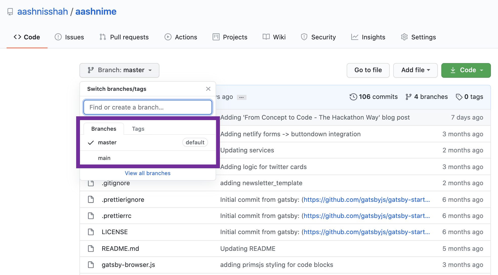
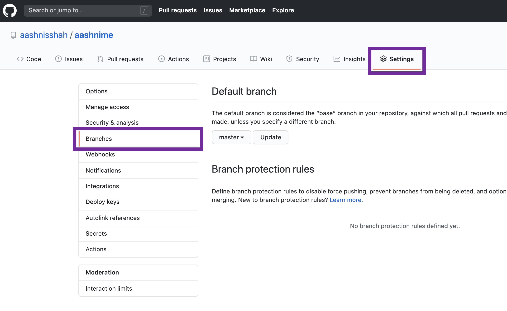
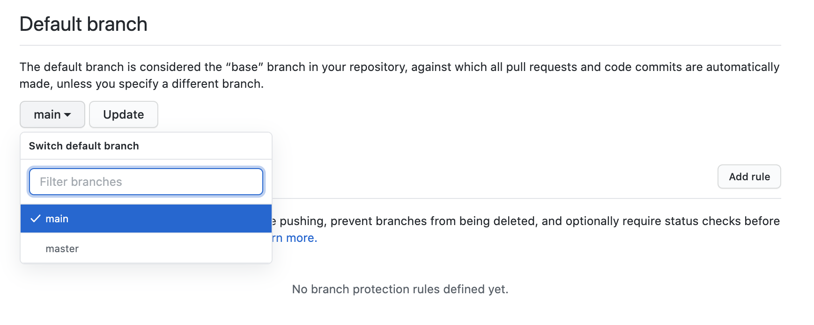
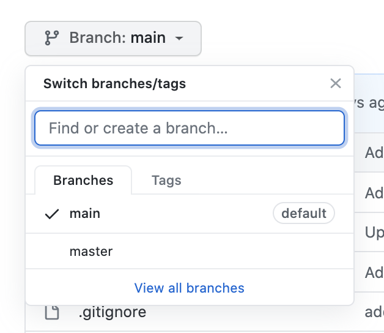

In a previous post we explored [basic git commands](./../a-git-guide-for-beginners/). In this post, I originally wanted to explore unlocking more git flows like rebasing or using multiple branches. But I couldn't in good conscious include another post without writing or addressing the current conversation related to Black Lives Matter around using `main` instead of `master` as the name of your main branch. I decided to write up a quick guide on how to easily change the name of your branch from `main` to `master` instead.

# What is a Branch
A branch is a pointer to a sequence of `commits` or changes that you have made. Most teams use a system where they have a `main` branch to represent their `production` version of code, one for their `staging` environment, and then create `feature` branches anytime they're working on a change.

Historically, the main branch created when a repository is initially created is called `master`.

# How to Change the Name Locally
First check to make sure you have no out of date or unstaged changes.

```bash
> git status
```

If you have any files listed here, either stash them using `git stash` (and bring them back later using `git stash pop`), commit the changes or delete the changes.

Next make sure you're on the `master` branch.

```bash
> git branch
```

If you don't get a `*` besides `master` in your output, it means you're on a different branch. to correct this, type `git checkout master`. 

Now we'll change the name. This is a two step process. 

```bash
> git branch -m master main
```

Here we use `-m` to move your commit history onto a new branch called `main`. If you try `git branch` you'll notice the `*` is now on a branch called `main` and `master` can't be found.

```bash
> git push -u origin main
```

Next we want to push the `main` branch changes up to the remote origin (where your code is stored). The `-u` command creates an upstream connection.

# Update Global Settings

Locally, your work is done! Next you'll need to log in to your git manager to make a couple more changes. In my case, I use [github](https://github.com). Navigate to your repository, for me that is [github.com/aashnisshah/aashnime](https://github.com/aashnisshah/aashnime). You can verify that your branch was successfully pushed by selecting the `Branch: master` tab. As you can see in the image below, `master` is set to my default, and there's another branch called `main`.

[](./rename-master-main-01.png)

Navigate to the `Settings` tab, then choose `Branches` in the sidebar menu that pops up. 

[](./rename-master-main-02.png)

Once you're on the branches settings page, select the branch dropdown under the `Default Branches` section and select `main`. The select `Update` and follow the prompts.

[](./rename-master-main-03.png)

If you go back to the main repo page and select the branch dropdown, you'll notice `main` now has the `default` tag on it.

[](./rename-master-main-04.png)

The only thing left to do is to cleanup your `master` repository. On that branch dropdown, select `View all branches`, then delete master.

# Some Things to Note
If you use branches in your workflow, you may need to update the branches to work with the new `main` branch.

If you work with other teams, you'll need to coordinate the rename effort to ensure no code changes are lost during the process.

**This entire process took less than 5 minutes to do. A small, simple change is likely inconsequential for you, but could have a huge positive impact on someone else. Make the change and encourage your employers to do the same.**