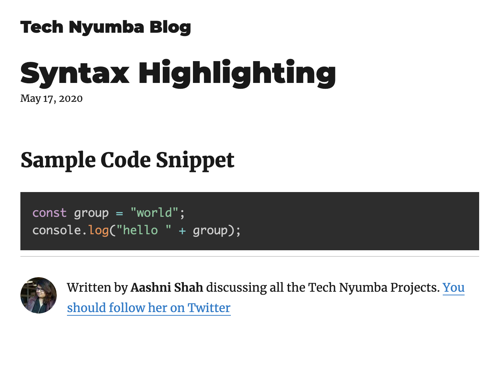
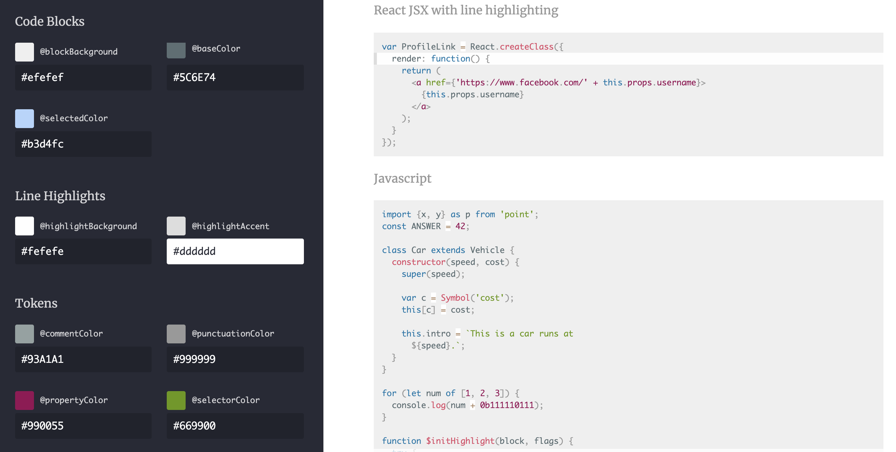
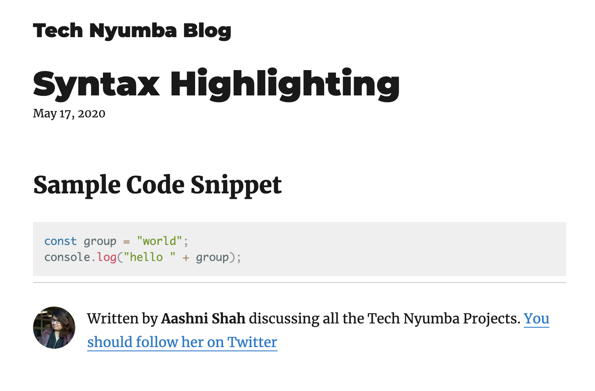

You've reached the point where you want to start displaying code on your site, however you're not too keen on the default color schemes that come built in. Fear not! This post will help you figure out how to configure your own color schemes so that they match your website. This post in general focuses on tools for Gatsby and React, however many of the tools mentioned before will work for other frontend frameworks as well.

# Setting up PrismJS
We'll be using [gatsby-remark-prismjs](https://www.gatsbyjs.org/packages/gatsby-remark-prismjs/) to get the nicer syntax highlighting setup. Our first step is to install it for our project. While we're at it, we'll also install `gatsby-transformer-remark` and `prismjs` as well.

```bash
npm install --save gatsby-remark-prismsjs
npm install --save gatsby-transformer-remark
npm install --save prismjs
```

Next we'll want to configure this in our `gatsby-config.js` file. You will likely already have `gatsby-transformer-remark` as a main plugin, and possibly `gatsby-remark-prismjs` as a child plugin. If not, this is what the general structure should look like. Note anywhere I use `...` signifies other code likely also exists there. The code below is what I use, following most of the default settings. To get a better idea of each value, [read the gatsby-remark-primsjs documentation](https://www.gatsbyjs.org/packages/gatsby-remark-prismjs/).

```javascript
module.exports = {
  siteMetadata: {...},
  plugins: [
    ...,
    resolve: `gatsby-transformer-remark`,
    options: {
      plugins: [
        ...,
        {
          resolve: `gatsby-remark-prismjs`,
          options: {
            classPrefix: "language-",
            inlineCodeMarker: null,
            aliases: {},
            showLineNumbers: false,
            noInlineHighlight: false,
            languageExtensions: [
              {
                language: "superscript",
                extend: "javascript",
                definition: {
                  superscript_types: /(SuperType)/,
                },
                insertBefore: {
                  function: {
                    superscript_keywords: /(superif|superelse)/,
                  },
                },
              },
            ],
            prompt: {
              user: "root",
              host: "localhost",
              global: false,
            },
            escapeEntities: {},
          },
        },
        ...
      ]
    }
  ]
}
```

Let's test to make sure this works as expected. If you already have code snippets on a blog post, then render the page in your browser and check for the changes. As a general reminder, you want your code snippets to make use of a triple backtick symbol, and you can add the language you're using too.

    ## Sample Code Snippet
    ```javascript
    const group = "world";
    console.log("hello " + group);
    ```

For testing purposes, I'll create a new blog post called `Syntax Highlighting` and add the code snippet to it. To do this, I'll create a folder called `syntax-highlighting` under `content\blog`. After this, I'll create a file called `index.md`, and add the following content to the `index.md` file (which will house the contents of our blog post).

    ---
    title: Syntax Highlighting
    date: "2020-05-17T22:40:32.169Z"
    description: Testing out custom syntax highlighting options
    ---

    ## Sample Code Snippet
    ```javascript
    const group = "world";
    console.log("hello " + group);
    ```

If you have everything setup correctly, this is what you'll see.

[](./syntax-highlighting-01.png)

## Getting Some Themed Colors

Prism offers some themed color schemes that you can use. You can see previews of them on the [Prismjs.com website](https://prismjs.com/), and copy code themes from their [github](https://github.com/PrismJS/prism/tree/1d5047df37aacc900f8270b1c6215028f6988eb1/themes). I like the [tomorrow night or prism-tomorrow theme](https://github.com/PrismJS/prism/blob/1d5047df37aacc900f8270b1c6215028f6988eb1/themes/prism-tomorrow.css), and will now get that configured to work for my blog.

Open up the `gatsby-browser.js` file and change `import "prismjs/themes/prism.css` to `import "prismjs/themes/prism-tomorrow.css`. Reload your browser and you'll see the darker theme take effect immediately.

[](./syntax-highlighting-02.png)

## Using Custom Colors

While this theme looks nice, it might not completely go with the colors of your website. You can definitely copy one of the pre-existing `prism` css files, and then start playing around with them, but what if I told you there was a better way? An easier way?

While setting up the syntax highlighting for my personal blog, I stumbled across [@k88hudson's](https://twitter.com/k88hudson) easy to use [Syntax Highlighting Theme Generator](http://k88hudson.github.io/syntax-highlighting-theme-generator/www/).

Play around with the colors on the right until you're happy with the different syntax highlighted color blocks on your page. Keep an eye on the code blocks that most relate to you (i.e. for me it would be `javascript` blocks), to make sure you really like how the colors work together. 

[](./syntax-highlighting-03.png)

Once you're done, press the `Download CSS` button on the bottom right. The move that file so that it falls under `src/styles/`. I named mine `prism-theme.css`, so the file path is `src/styles/prism-theme.css`.

Head back to the `gatsby-browser.js` file, and swap the `import "prismjs/themes/prism.css"` change you made earlier with `import "./src/styles/prism-theme.css"` instead. This tells the browser to look for your custom prism theme file instead.

Reload your page and make sure your new styles load properly! Here's what mine looks like.

[](./syntax-highlighting-04.png)

Voila! 