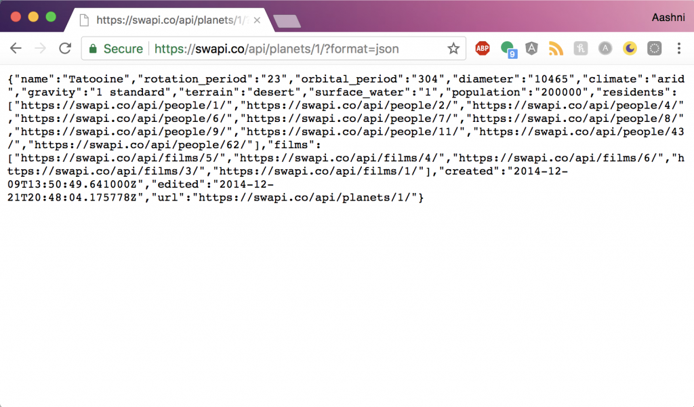

Following on from last week’s post, [A Guide to Web Development for Beginners](https://aashni.me/blog/a-guide-to-web-development-for-beginners/), I wanted to a do a deeper dive into some of the concepts I mentioned in that post, such as backend servers, databases and APIs. I’ll pick APIs today, as they’re a pretty vital component of how the other three can work together. 

## APIs

API stands for `Application Programming Interface`, and like all interfaces, the API let’s two applications communicate. It’s how you can send information from the frontend to the backend, or fetch data from a completely separate app. I’ve already written a few blog posts before that show you examples of using APIs, such as the [Intro to Slack Apps](https://aashni.me/blog/an-intro-to-slack-apps/), [Using Firebase to Upload Files](hhttps://aashni.me/blog/using-firebase-to-upload-files/) or [Making Maps with Googles Map API](https://aashni.me/blog/making-maps-with-googles-map-api/).

API’s cover all types of communication, and there are several types such as [SOAP](https://en.wikipedia.org/wiki/SOAP) or [CORS](https://developer.mozilla.org/en-US/docs/Web/HTTP/CORS), however I’ll focus on [REST](https://developer.mozilla.org/en-US/docs/Glossary/REST) API’s in this post.

## RESTful APIs

REST stands for `Representational State Transfer`. It acts as a set of architectural constraints or rules on how to get or send data between two applications through the HTTP protocol. It’s important to remember that **all** RESTful requests are considered API’s, but that **not all** API’s are RESTful requests. They follow HTTP’s concept of `verbs`, such as `Get` and `Post`. These are the two most common verbs, or types of requests being made, where you either get/fetch the information from an endpoint, or you post/send information to it.

## Internal APIs

Most websites and apps use APIs to connect their frontend to their backend. For example, the frontend might have a form which a user can use to input information (like their login details or a new tweet they want to write). The frontend will then take that data, attach it to an API request, and send that data to the backend. The backend will then analyze the information, perform whatever actions it needs to perform (like letting a user login, or saving their tweet to a database), then return a response to the frontend. These are known as `internal APIs`.

## External APIs

A company may later decide to expand and share these APIs with the general public. Since they follow the HTTP protocol, you can treat these APIs like you would a website, by visiting the API URL and retrieving your data. Let’s take a look at an example API URL first. An API consists of a base url, route, resource requested, and often times a combination of expected response format, and request key. I’ll use the [Star Wars API](https://swapi.co) for this example.

    
    https://swapi.co/api/planets/1/?format=json

Here, the `https://swapi.co/` acts as the base url.`api/` is the route. The specific resource we’d like to know about is `planets/`. I could leave out the `1/`, however it adds some more specification on the type of information I want. Without the 1, we’d get a list of all planets and their data, with the 1 (or any other valid number), we’re able to specify which planet resource we want. Finally, this query appends `?format=json` to the end to specify we want a JSON object. Each API is different and what return types they support also differs, where some websites may return back XML if specified. If I ran this as a URL in the browser, I’d see a JSON object with information about Tatooine.

## Cross Origin Errors

Let’s imagine we wanted to create a website that would fetch this information from SWAPI, and then display it on our own website. If we tried to do a direct JSON Get call, we’d be hit with a Cross Origin error message like this:

    
    ERROR : Cross-Origin Request Blocked: The Same Origin Policy disallows reading the remote resource at the url. This can be fixed by moving the resource to the same domain or enabling CORS.

As a security step, websites don’t allow you to modify a page based on data you pulled from an external API. There are two ways to fix it, using either JSONP or CORS. JSONP has been around for longer, and as such is supported by more browsers, however it has a Cross Site Scripting issue that may arise if there’s an issue with the website it’s trying to fetch data from. CORS is newer, and more people are shifting towards using it, however it’s not supported in all browsers (like < IE 9). In order to get JSONP to work, you’ll need to modify the body of the content being returned. With CORS, you’ll modify the header of the request being sent out instead. For today’s example, I’ll show a JSONP implementation.

## JSONP

JSONP avoids the cross-origin issue because it makes a call for the data using a script tag, instead of a pull request. When this script tag returns, we’d be getting a javascript object returned with JSON (or any other type of text) as the data within that function. As such, we’d need to deal with this function to extract the data. We do this by appending `callback={functionName}` to the end of our request URL, then creating a function `functionName()` that can now search and modify the data.

    
    var script = document.createElement('script');
    script.src = 'https://swapi.co/api/planets/1/?format=json&callback;=jsonpcallback';
    document.body.appendChild(script);

    
    function jsonpcallback(json) {
        console.log(json);
    }

Once you’re able to access the data on your page, you’d treat it the same way you’d treat any other data and can now manipulate and display it too.
